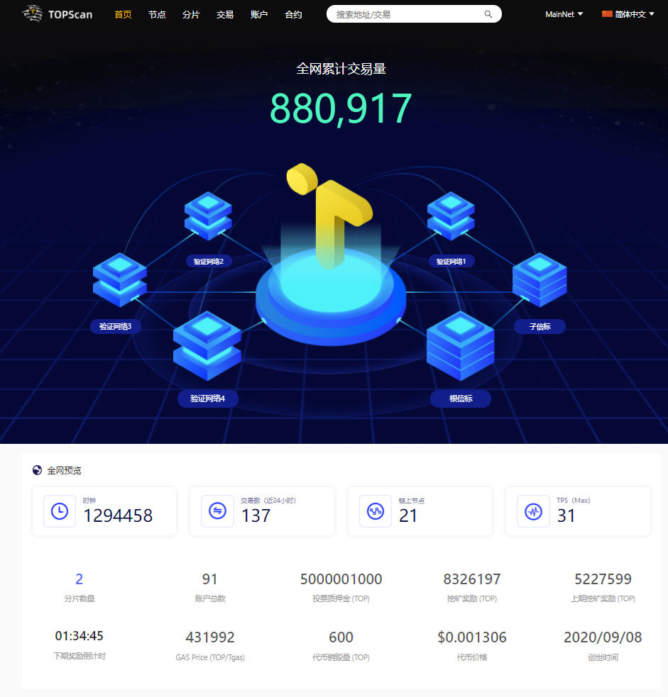

# TOP Network入门

本章将带您快速入门TOP Network的世界。

- [从接收与转出TOP开始](docs-cn/GetStartedonTOPNetwork/ReceiveandSendTOP.md)

  创建您的TOP Network账户，并获取TOP，学习如何发送TOP到另外一个不同的账户地址。

- [成为TOP Network节点](docs-cn/GetStartedonTOPNetwork/BecomeATOPNetworkNode.md)

  适用于想为区块链系统提供计算、存储、网络能力，同时获得奖励的用户。

- [参与投票](docs-cn/GetStartedonTOPNetwork/VoteOnNodes.md)

  适用于想投票给自己支持的节点，让更优秀的节点获得更多的奖励，同时获得投票分红的用户。

## **我们已为您准备的应用**

* **挖矿软件**

| 名称                                     | 说明                                                         |
| ---------------------------------------- | ------------------------------------------------------------ |
| [TOPIO](docs-cn/Tools/TOPIO/Overview.md) | 主网专用命令行客户端，支持主流Linux系统，不仅包含节点进程，还包含守护进程——节点进程意外停止后可自动重启节点进程。 |

- **钱包**

  用于管理私钥与TOP Network区块链资产。

| 名称                                     | 说明                                      |
| ---------------------------------------- | ----------------------------------------- |
| [Hiwallet](#https://www.hiwallet.org/)   | 移动端钱包，支持iOS和安卓系统。           |
| [TOPIO](docs-cn/Tools/TOPIO/Overview.md) | 主网专用命令行客户端，支持主流Linux系统。 |

- **浏览器**

查询区块链上的各类信息与数据。

| 名称                                          | 说明                                                         |
| --------------------------------------------- | ------------------------------------------------------------ |
| [TOPSCAN](#http://104.248.153.202:7002/zh-CN) | Web应用，提供区块链网络浏览功能。  |
| [TOPIO](docs-cn/Tools/TOPIO/Overview.md)      | 命令行客户端，支持查询区块链网络信息，支持主流Linux系统。    |

