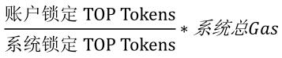

# Java SDK

## 快速开始

实例化"topj"。

```java
package org.sawyer;

import org.topj.account.Account;
import org.topj.core.Topj;
import org.topj.procotol.http.HttpService;
import java.io.IOException;

public class main {
    private static Topj topj = null;
    private static Account account = null;
    public static void main(String[] args) throws IOException {
        HttpService httpService = new HttpService("http://192.168.50.193:19081");
        topj = Topj.build(httpService);
    }
}
```

## 网络

TOP Network Java SDK提供了RPC、Restful以及WebSocket接口。

* RPC接口 

  ```
  HttpService httpService = new HttpService("http://192.168.50.193:19081");
  ```

* Restful接口 

  ```
  HttpService httpService = new HttpService("http://192.168.50.193:19081");
  ```

* WebSocket接口 

  ```
  
  ```

## 接口总览

| 接口                                       | 描述                          |
| :---------------------------- | :---------------------------- |
| [topj.setTransactionReceiptProcessor()](#交易初始化设置) | 交易初始化设置。              |
| [topj.genAccount()](#根据私钥生成account账户对象)        | 根据私钥生成account账户对象。 |
| [topj.passport()](#获取链上访问身份令牌)                 | 获取链上访问身份令牌。        |
| [topj.getChainInfo()](#获取主链信息)                     | 获取主链信息。                |
| [topj.getAccount()](#查询链上账户信息)                   | 获取链上账户信息。          |
| [topj.transfer()](#转账)                                 | 将TOP转到另外一个账户地址。 |
| [topj.getTransaction()](#查询账户交易详情)               | 获取账户交易详情。      |
| [topj.stakeGas()](锁定TOP_token兑换gas)                  | 锁定TOP token兑换gas。        |
| [topj.unStakeGas()](解锁兑换gas的TOP_token)              | 解锁兑换gas的TOP token。      |
| [topj.deployContract()](#部署用户智能合约)               | 部署用户智能合约。            |
| [topj.callContract()](#调用用户智能合约)                 | 调用用户智能合约。            |
| [topj.getProperty()](#获取属性)                          | 获取属性。                    |
| [topj.registerNode()](#注册节点)                         | 注册节点。                    |
| [topj.queryNodeInfo()](#查询节点信息)                    | 查询节点信息。                |
| [topj.updateNodeType()](#更新节点类型)                    | 更新节点类型。                |
| [topj.setNodeName()](#设置节点昵称)                    | 设置节点昵称。                |
| [topj.stakeDeposit()](#增加节点保证金)                    | 增加节点保证金。                |
| [topj.unStakeDeposit()](#减少节点保证金)                    | 减少节点保证金。                |
| [topj.setDividendRate()](#设置分红比例)                    | 高级节点设置分红比例。         |
| [topj.listVoteUsed()](#查询账户投票分布信息)  | 获取账户投票分布。 |
| [topj.unRegisterNode()](#注销节点)                       | 注销节点。                    |
| [topj.redeemNodeDeposit()](#赎回节点保证金)              | 节点注销后赎回节点保证金。      |
| [topj.stakeVote()](#锁定TOP_token兑换选票)               | 锁定TOP token兑换选票。       |
| [topj.unStakeVote()](#解锁兑换选票的TOP_token)           | 解锁兑换选票的TOP token。     |
| [topj.voteNode()](#节点投票)                             | 投票。                    |
| [topj.unVoteNode()](#取消投票)                           | 取消投票。                    |
| [topj.queryVoterDividend()](#获取投票者分红信息)       | 获取投票者分红信息。        |
| [topj.claimVoterDividend()](#领取投票者分红)           | 领取投票者分红。        |
| [topj.queryNodeReward()](#获取节点奖励信息)              | 获取节点奖励信息。            |
| [topj.claimNodeReward()](#领取节点奖励)                  | 领取节点奖励。                |
| [topj.submitProposal()](#提交提案)                       | 提交提案。                    |
| [topj.withdrawProposal()](#撤回提案)                     | 撤回提案。                    |
| [topj.queryProposal()](#获取提案详情)                    | 获取提案详情。                |
| [topj.tccVote()](#TCC表决提案)                           | TCC表决提案                   |

| 工具方法                                                     | 描述                                   |
| :----------------------------------------------------------- | :------------------------------------- |
| [transferActionParam.decode](#解析出转账交易体中的amount和note数据) | 解析出转账交易体中的amount和note数据。 |
| [topj.setTransactionReceiptProcessor](#交易初始化设置)       | 交易初始化设置。                       |
| [xTransaction.isSuccess](#判断交易是否成功)                  | 判断交易是否成功。                     |
| [交易体对象说明](#交易体对象说明)                            | 所有交易请求都返回该对象。             |

## 交易初始化设置

SDK发送交易请求后，请求无法直接返回交易执行结果，所以需要循环去链上查询交易是否成功，默认每3秒查询一次，循环100次，共5分钟。如果此时交易仍查询不到，则程序返回交易hash。

“setTransactionReceiptProcessor”方法可以修改循环查询间隔以及循环次数，比如示例代码中修改为每5秒查询一次，循环3次，共15秒。

**请求方式**

> topj.setTransactionReceiptProcessor

**请求参数**

"TransactionReceiptProcessor"为抽象类，有"PollingTransactionReceiptProcessor"和"NoOpProcessor"两个实现类，可实例化这两个类并传入。

"PollingTransactionReceiptProcessor"表示会轮询"attempts"次，每次间隔"sleepDuration"毫秒。

实例化所需参数如下表所示。

| 参数名称      | 是否必选 | 默认值 | 类型 | 说明                   |
| ------------- | -------- | ------ | ---- | ---------------------- |
| sleepDuration | 是       | -      | Long | 等待间隔，单位“毫秒”。 |
| attempts      | 是       | -      | Int  | 循环次数。             |

也可设置不循环，直接返回交易hash，传入"NoOpProcessor"对象接口，代码为：

```
topj.setTransactionReceiptProcessor(new NoOpProcessor())
```

"NoOpProcessor"表示直接返回hash，无须参数。

**请求样例**

``` java
package org.sawyer;

import org.topj.account.Account;
import org.topj.core.Topj;
import org.topj.procotol.http.HttpService;
import org.topj.tx.PollingTransactionReceiptProcessor;
import java.io.IOException;

public class main {
    private static Topj topj = null;
    private static Account account = null;
    public static void main(String[] args) throws IOException {

        HttpService httpService = new HttpService("http://192.168.50.193:19081");
        topj = Topj.build(httpService);
        topj.setTransactionReceiptProcessor(new PollingTransactionReceiptProcessor(5000, 3));
    }
}
```

## 链基础操作

### 根据私钥生成account账户对象

本地根据私钥生成账户对象，对象中包含私钥、公钥、地址等参数。

**请求方法**

> topj.genAccount

**请求参数**

| 参数名称   | 是否必选 | 默认值 | 类型   | 说明   |
| ---------- | -------- | ------ | ------ | ------ |
| privateKey | 是       | -      | String | 私钥。 |

**返回参数**

| 参数名称        | 类型    | 说明                                                         |
| --------------- | ------- | ------------------------------------------------------------ |
| address         | String  | 账户地址。                                                   |
| addressType     | String  | 账户地址类型：0--普通用户账户；1--子账户；2--系统合约账户；3--用户合约账户。 |
| balance         | Uint64  | 账户余额。                                                   |
| lastUnitHeight  | Uint64  | 最新共识成功的交易的unit block高度。                         |
| netType         | Integer | 网络类型，"0"--主网、"1"--测试网。                           |
| nonce           | Uint64  | 该账户最新共识成功的交易序号，唯一。                         |
| privateKey      | String  | 私钥用于解密和交易签名。<br/>请不要与其他人分享您的私钥，以免造成资产损失！ |
| privateKeyBytes | String  | 私钥的Byte格式。                                             |
| publicKey       | String  | 公钥，和私钥总是成对出现。<br/>用于加密及验签。              |
| sequenceId      | String  | 客户端会话次数，递增。                                       |
| identityToken   | String  | 与链交互前首先需要获取链访问身份令牌(identity token)，身份令牌因账户不同而不同。当前未对该字段进行校验。 |

本地生成account主要用于生成公私钥和地址，其他参数，除了“token"，均为初始值，需调用`topjs.getAccount`方法获取链上真实值。

**请求样例**

``` java
package org.test;

import org.topj.account.Account;
import org.topj.core.Topj;
import org.topj.procotol.http.HttpService;

public class main {
    private static Topj topj = null;
    private static Account account = null;

    public static void main(String[] args){
        HttpService httpService = new HttpService("http://localhost:19081");
        topj = Topj.build(httpService);
        account = topj.genAccount();
    }
}
```

**返回样例**

```javascript
{
    "address":"T-0-LVqncsABDB49GVzwwV5LGx9gBStf4HD9XW",
    "addressType":"0",
    "balance":0,
    "lastUnitHeight":0,
    "netType":0,
    "nonce":0,
    "privateKey":"ec8519c723649ab2170807d39a9d01be1a6197266cfe39b4cc66c0433df85321",
    "privateKeyBytes":"7IUZxyNkmrIXCAfTmp0BvhphlyZs/jm0zGbAQz34UyE=",
    "publicKey":"04ba6f20d132c94044fb0dd36035c3a9fc11ce30d6f3252e16083add3c78a76fe692d980754d77ba06594e70dfa51dbfe87832e5b38c91a03fdeae80ed0b414f65",
    "sequenceId":"1600657385123",
    "identityToken": ""
}
```


### 获取链上访问身份令牌

根据账户获取identity token（身份令牌），每个账户token不同。在后续所有的请求中，都需要token参数。

**请求方法**

> topj.passport

**请求参数**

| 参数名称 | 是否必选 | 默认值 |  类型   | 说明       |
| :------: | :------: | :----: | :-----: | ---------- |
| account  |    是    |   -    | Account | 账户对象。 |

**返回参数**

返回值中包含token字段，已直接放入account对象中，供后续调用时使用。

| 参数名称           | 类型   | 说明                                                     |
| ------------------ | ------ | -------------------------------------------------------- |
| secret_key         | String | 密钥key。                                                |
| signature_method   | String | 签名方法。                                               |
| signature_ver_code | String | 签名方法版本号。                                         |
| identity_token     | String | 身份令牌，用于和主链节点交互，后续所有请求都需要该参数。 |

**请求样例**

``` java
package org.sawyer;

import com.alibaba.fastjson.JSONObject;
import org.topj.account.Account;
import org.topj.core.Topj;
import org.topj.methods.response.PassportResponse;
import org.topj.methods.response.ResponseBase;
import org.topj.procotol.http.HttpService;
import org.topj.tx.PollingTransactionReceiptProcessor;
import java.io.IOException;

public class main {

    private static Topj topj = null;
    private static Account account = null;
    public static void main(String[] args) throws IOException {

        HttpService httpService = new HttpService("http://192.168.50.193:19081");
        topj = Topj.build(httpService);
        topj.setTransactionReceiptProcessor(new PollingTransactionReceiptProcessor(5000, 3));
        account = topj.genAccount();
        ResponseBase<PassportResponse> token =topj.passport(account);
        System.out.println(JSONObject.toJSONString(token));
    }
}

```

**返回样例**

``` java
{
    "data":{
        "identity_token":"c139fb51-d541-41f5-9d9d-4e6c083766f1",
        "secret_key":"fc06ccea-c34d-40b5-8b93-f985c6f3ecee",
        "signature_method":"hmac_sha2",
        "signature_ver_code":"1.0"
    },
    "errmsg":"ok",
    "errno":0,
    "sequence_id":"1600657932853"
}
```

### 获取主链信息

**请求方法**

> topj.getChainInfo

**请求参数**

| 参数名称 | 是否必选 | 默认值 |  类型   | 说明       |
| :------: | :------: | :----: | :-----: | ---------- |
| account  |    是    |   -    | Account | 账户对象。 |

**返回参数**

| 参数名称                | 类型   | 说明                                                         |
| ----------------------- | ------ | ------------------------------------------------------------ |
| first_timerblock_hash   | String | 第一个时钟块hash。                                           |
| first_timerblock_stamp  | Uint64 | 第一个时钟块生成时间。                                       |
| init_total_locked_token | Uint64 | 系统初始化总TOP token锁定金额，系统初始化gas兑换率=系统总gas/总锁定金额，避免系统初始化gas兑换率为0。 |
| token_price             | Uint64 | 锁定TOP token兑换gas的兑换率，单位tgas/top。                 |
| total_gas_shard         | Uint32 | 单片24小时总gas量。                                          |
| validator_group_count   | Uint32 | validator group 数量，当前默认为4。                          |
| version                 | String | 主链版本。                                                   |

**请求样例**

``` java
package org.sawyer;


import com.alibaba.fastjson.JSONObject;
import org.topj.account.Account;
import org.topj.core.Topj;
import org.topj.methods.response.ChainInfoResponse;
import org.topj.methods.response.ResponseBase;
import org.topj.procotol.http.HttpService;
import org.topj.tx.PollingTransactionReceiptProcessor;

import java.io.IOException;

public class main {

    private static Topj topj = null;
    private static Account account = null;

    public static void main(String[] args) throws IOException {

        HttpService httpService = new HttpService("http://192.168.50.193:19081");
        topj = Topj.build(httpService);
        topj.setTransactionReceiptProcessor(new PollingTransactionReceiptProcessor(5000, 3));
        account = topj.genAccount();
        topj.passport(account);
        ResponseBase<ChainInfoResponse> chainInfo = topj.getChainInfo(account);
        System.out.println(JSONObject.toJSONString(chainInfo));
    }
}
```

**返回样例**

``` java
{
   "data" : {
      "first_timerblock_hash" : "6cf8958ac646a2b41bcdbfbdcfd8e0a9568aaf980073e96d488d82730cf7c698",
      "first_timerblock_stamp" : 946713600,
      "init_total_locked_token" : 10000000000000,
      "token_price" : 432000,
      "total_gas_shard" : 2160000000000,
      "validator_group_count" : 2,
      "version" : "0.0.0.1"
   },
   "errmsg" : "OK",
   "errno" : 0,
   "sequence_id" : "10"
}
```

### 获取候选池所有节点

**请求方法**

> topj.getAllStandBys

**请求参数**

| 参数名称 | 是否必选 | 默认值 |  类型   | 说明       |
| :------: | :------: | :----: | :-----: | ---------- |
| account  |    是    |   -    | Account | 账户对象。 |

**返回参数**

| 参数名称             | 类型   | 说明                                                         |
| -------------------- | ------ | ------------------------------------------------------------ |
| node_sign_key        | String | 节点注册时使用的公钥。账户公钥或者无资产的公私钥对中的公钥。 |
| node_account_address | String | 节点账户地址。                                               |
| program_version      | String | 主链版本号。                                                 |
| stake                | Unit64 | 节点权益。                                                   |

**请求样例**

``` java
package org.sawyer;


import com.alibaba.fastjson.JSONObject;
import org.topj.account.Account;
import org.topj.core.Topj;
import org.topj.methods.response.StandBysResponse;
import org.topj.methods.response.ResponseBase;
import org.topj.procotol.http.HttpService;
import org.topj.tx.PollingTransactionReceiptProcessor;

import java.io.IOException;

public class main {

    private static Topj topj = null;
    private static Account account = null;

    public static void main(String[] args) throws IOException {

        HttpService httpService = new HttpService("http://192.168.50.193:19081");
        topj = Topj.build(httpService);
        topj.setTransactionReceiptProcessor(new PollingTransactionReceiptProcessor(5000, 3));
        account = topj.genAccount();
        topj.passport(account);
        ResponseBase<StandBysResponse> sb = topj.getAllStandBys(account);
        System.out.println(JSONObject.toJSONString(sb));
    }
}
```

**返回样例**

``` java
{
    "data":{
        "arc":[
            {
                "node_account_address":"T-0-LKfBYfwTcNniDSQqj8fj5atiDqP8ZEJJv6",
                "node_sign_key":"BFFVnheBS2yJLwlb+q6xH/DL+RotbvRdd9YeJKug1tP+WppTdB36KzMOHxmHTsh5u9BKgPDgXppFvyBeqYUxoTU=",
                "program_version":"1.0.0.0",
                "stake":0
            }
        ],
        "auditor":[
            {
                "node_account_address":"T-0-LKfBYfwTcNniDSQqj8fj5atiDqP8ZEJJv6",
                "node_sign_key":"BFFVnheBS2yJLwlb+q6xH/DL+RotbvRdd9YeJKug1tP+WppTdB36KzMOHxmHTsh5u9BKgPDgXppFvyBeqYUxoTU=",
                "program_version":"1.0.0.0",
                "stake":0
            }
        ],
        "edge":[
            {
                "node_account_address":"T-0-LKfBYfwTcNniDSQqj8fj5atiDqP8ZEJJv6",
                "node_sign_key":"BFFVnheBS2yJLwlb+q6xH/DL+RotbvRdd9YeJKug1tP+WppTdB36KzMOHxmHTsh5u9BKgPDgXppFvyBeqYUxoTU=",
                "program_version":"1.0.0.0",
                "stake":0
            }
        ],
        "root_beacon":[
            {
                "node_account_address":"T-0-LKfBYfwTcNniDSQqj8fj5atiDqP8ZEJJv6",
                "node_sign_key":"BFFVnheBS2yJLwlb+q6xH/DL+RotbvRdd9YeJKug1tP+WppTdB36KzMOHxmHTsh5u9BKgPDgXppFvyBeqYUxoTU=",
                "program_version":"1.0.0.0",
                "stake":0
            }
        ],
        "sub_beacon":[
            {
                "node_account_address":"T-0-LKfBYfwTcNniDSQqj8fj5atiDqP8ZEJJv6",
                "node_sign_key":"BFFVnheBS2yJLwlb+q6xH/DL+RotbvRdd9YeJKug1tP+WppTdB36KzMOHxmHTsh5u9BKgPDgXppFvyBeqYUxoTU=",
                "program_version":"1.0.0.0",
                "stake":0
            }
        ],
        "validator":[
            {
                "node_account_address":"T-0-LKfBYfwTcNniDSQqj8fj5atiDqP8ZEJJv6",
                "node_sign_key":"BFFVnheBS2yJLwlb+q6xH/DL+RotbvRdd9YeJKug1tP+WppTdB36KzMOHxmHTsh5u9BKgPDgXppFvyBeqYUxoTU=",
                "program_version":"1.0.0.0",
                "stake":0
            }
        ]
    },
    "errmsg":"ok",
    "errno":0,
    "sequence_id":"1600658014340"
}
```

### 获取候选池单个节点信息

**请求方法**

> topj.getAllStandBys

**请求参数**

| 参数名称 | 是否必选 | 默认值 |  类型   | 说明       |
| :------: | :------: | :----: | :-----: | ---------- |
| account  |    是    |   -    | Account | 账户对象。 |
|          |          |        |         |            |

**返回参数**

| 参数名称             | 类型   | 说明                                                         |
| -------------------- | ------ | ------------------------------------------------------------ |
| node_sign_key        | String | 节点注册时使用的公钥。账户公钥或者无资产的公私钥对中的公钥。 |
| node_account_address | String | 节点账户地址。                                               |
| program_version      | String | 主链版本号。                                                 |
| stake                | Unit64 | 节点权益。                                                   |

**请求样例**

``` java
package org.sawyer;


import com.alibaba.fastjson.JSONObject;
import org.topj.account.Account;
import org.topj.core.Topj;
import org.topj.methods.response.StandBysResponse;
import org.topj.methods.response.ResponseBase;
import org.topj.procotol.http.HttpService;
import org.topj.tx.PollingTransactionReceiptProcessor;

import java.io.IOException;

public class main {

    private static Topj topj = null;
    private static Account account = null;

    public static void main(String[] args) throws IOException {

        HttpService httpService = new HttpService("http://192.168.50.193:19081");
        topj = Topj.build(httpService);
        topj.setTransactionReceiptProcessor(new PollingTransactionReceiptProcessor(5000, 3));
        account = topj.genAccount();
        topj.passport(account);
        ResponseBase<StandBysResponse> sb = topj.getAllStandBys(account);
        System.out.println(JSONObject.toJSONString(sb));
    }
}
```

**返回样例**

``` java
{
    "data":{
        "node_account_address":"T-0-LKfBYfwTcNniDSQqj8fj5atiDqP8ZEJJv6",
        "node_sign_key":"BFFVnheBS2yJLwlb+q6xH/DL+RotbvRdd9YeJKug1tP+WppTdB36KzMOHxmHTsh5u9BKgPDgXppFvyBeqYUxoTU=",
        "program_version":"1.0.0.0",
        "stake":0
    },
    "errmsg":"ok",
    "errno":0,
    "sequence_id":"1600658014340"
}
```

### 获取链上治理参数

**请求方法**

> topj.getCGP

**请求参数**

| 参数名称 | 是否必选 | 默认值 |  类型   | 说明       |
| :------: | :------: | :----: | :-----: | ---------- |
| account  |    是    |   -    | Account | 账户对象。 |

**返回参数**

请参见[链上治理参数](docs-cn/On-ChainGovernance/On-ChainGovernanceParameters.md)。

**请求样例**

``` java
package org.sawyer;


import com.alibaba.fastjson.JSONObject;
import org.topj.account.Account;
import org.topj.core.Topj;
import org.topj.methods.response.ChainInfoResponse;
import org.topj.methods.response.CGPResponse;
import org.topj.procotol.http.HttpService;
import org.topj.tx.PollingTransactionReceiptProcessor;

import java.io.IOException;

public class main {

    private static Topj topj = null;
    private static Account account = null;

    public static void main(String[] args) throws IOException {

        HttpService httpService = new HttpService("http://192.168.50.193:19081");
        topj = Topj.build(httpService);
        topj.setTransactionReceiptProcessor(new PollingTransactionReceiptProcessor(5000, 3));
        account = topj.genAccount();
        topj.passport(account);
        ResponseBase<CGPResponse> cgp = topj.getCGP(account);
        System.out.println(JSONObject.toJSONString(cgp));
    }
}
```

**返回样例**

``` java
{ 
   "data" : { 
      "additional_issue_year_ratio" : "8", 
      "application_contract_code_max_len" : "32768", 
      "archive_election_interval" : "11", 
      "archive_reward_ratio" : "3", 
      "auditor_group_count" : "2", 
      "auditor_reward_ratio" : "10", 
      "award_auditor_credit" : "30000", 
      "award_validator_credit" : "30000", 
      "backward_auditor_slash_credit" : "100000", 
      "backward_node_lock_duration_increment" : "103681", 
      "backward_validator_slash_credit" : "100000", 
      "beacon_tx_fee" : "100000000", 
      "bookload_max_block_per_table" : "32", 
      "cgc_proposal_expire_time" : "30", 
      "claim_node_reward_interval" : "8640", 
      "claim_voter_dividend_interval" : "8640", 
      "cluster_election_interval" : "71", 
      "cluster_election_minimum_rotation_ratio" : "66", 
      "cluster_zero_workload" : "0", 
      "contract_transaction_size" : "25", 
      "cpu_gas_exchange_ratio" : "40", 
      "cross_reading_rec_standby_pool_contract_height_step_limitation" : "2", 
      "cross_reading_rec_standby_pool_contract_logic_timeout_limitation" : "29", 
      "custom_property_max_number" : "128", 
      "custom_property_name_max_len" : "16", 
      "dividend_ratio_change_interval" : "120960", 
      "edge_election_interval" : "17", 
      "edge_reward_ratio" : "3", 
      "election_rotation_count_ratio" : "16", 
      "free_gas" : "25000", 
      "fullunit_contain_of_unit_num" : "21", 
      "governance_reward_ratio" : "4", 
      "initial_total_locked_token" : "10000000000000", 
      "leader_election_round" : "2", 
      "max_archive_group_size" : "512", 
      "max_auditor_group_size" : "64", 
      "max_auditor_rotation_count" : "2", 
      "max_edge_group_size" : "512", 
      "max_election_committee_size" : "256", 
      "max_gas_account" : "200000", 
      "max_gas_contract" : "10000000", 
      "max_nodedeposit_lock_duration" : "3153593", 
      "max_validate_stake" : "24500000", 
      "max_validator_group_size" : "128", 
      "max_vote_nodes_num" : "1000", 
      "min_archive_deposit" : "1000000000000", 
      "min_auditor_deposit" : "1000000000000", 
      "min_auditor_group_size" : "32", 
      "min_cgc_proposal_deposit" : "100000000", 
      "min_credit" : "100000", 
      "min_edge_deposit" : "100000000000", 
      "min_election_committee_size" : "32", 
      "min_free_gas_balance" : "100000000", 
      "min_mainnet_active_archives" : "1", 
      "min_mainnet_active_auditors" : "128", 
      "min_mainnet_active_edges" : "1", 
      "min_mainnet_active_validators" : "512", 
      "min_mainnet_active_votes" : "0", 
      "min_node_reward" : "0", 
      "min_ratio_annual_total_reward" : "2", 
      "min_stake_votes_num" : "1000", 
      "min_table_block_report" : "32", 
      "min_tx_deposit" : "100000", 
      "min_validator_deposit" : "500000000000", 
      "min_validator_group_size" : "32", 
      "min_voter_dividend" : "0", 
      "min_votes_num" : "100", 
      "nodes_per_segment" : "27", 
      "punish_interval_table_block" : "147456", 
      "punish_interval_time_block" : "8641", 
      "rec_election_interval" : "60480", 
      "rec_standby_pool_update_interval" : "10", 
      "reward_issue_interval" : "8640", 
      "schedule_table_num_per_clock" : "4", 
      "shard_zero_workload" : "0", 
      "sign_block_publishment_threshold_value" : "0", 
      "sign_block_ranking_publishment_threshold_value" : "10", 
      "sign_block_ranking_reward_threshold_value" : "0", 
      "sign_block_reward_threshold_value" : "80", 
      "sign_table_blocks_report_interval" : "311", 
      "tableblock_batch_tx_max_num" : "64", 
      "tableblock_batch_unitblock_max_num" : "64", 
      "task_num_per_round" : "16", 
      "tcc_member_number" : "T-0-Ldf7KcME5YaNvtFsr6jCFwNU9i7NeZ1b5a,T-0-LWUw2ioaCw3TYJ9Lsgu767bbNpmj75kv73,T-0-LTHfpc9otZwKmNcXA24qiA9A6SMHKkxwkg", 
      "toggle_whitelist" : "0", 
      "total_gas_shard" : "2160000000000", 
      "total_issuance" : "20000000000000000", 
      "tx_deposit_gas_exchange_ratio" : "100", 
      "tx_send_timestamp_tolerance" : "300", 
      "unitblock_confirm_tx_batch_num" : "8", 
      "unitblock_recv_transfer_tx_batch_num" : "4", 
      "unitblock_send_transfer_tx_batch_num" : "3", 
      "unlock_gas_staked_delay_time" : "8641", 
      "usedgas_decay_cycle" : "8641", 
      "validator_group_count" : "4", 
      "validator_reward_ratio" : "60", 
      "vote_reward_ratio" : "20", 
      "votes_report_interval" : "30", 
      "whitelist" : "T-0-LhCXUC5iQCREefnRPRFhxwDJTEbufi41EL,T-0-LefzYnVUayJSgeX3XdKCgB4vk7BVUoqsum,T-0-LeXNqW7mCCoj23LEsxEmNcWKs8m6kJH446,T-0-LXqp1NkfooMAw7Bty2iXTxgTCfsygMnxrT,T-0-LcNfcqFPH9vy3EYApkrcXLcQN2hb1ygZWE,T-0-LTHfpc9otZwKmNcXA24qiA9A6SMHKkxwkg,T-0-LLJ8AsN4hREDtCpuKAxJFwqka9LwiAon3M,T-0-Ldf7KcME5YaNvtFsr6jCFwNU9i7NeZ1b5a,T-0-LWUw2ioaCw3TYJ9Lsgu767bbNpmj75kv73,T-0-LKfBYfwTcNniDSQqj8fj5atiDqP8ZEJJv6,T-0-LTSip8Xbjutrtm8RkQzsHKqt28g97xdUxg,T-0-Lgv7jLC3DQ3i3guTVLEVhGaStR4RaUJVwA,T-0-LNi53Ub726HcPXZfC4z6zLgTo5ks6GzTUp,T-0-LVpL9XRtVdU5RwfnmrCtJhvQFxJ8TB46gB,T-0-LaFmRAybSKTKjE8UXyf7at2Wcw8iodkoZ8,T-0-LUv7e8RZLNtnE1K9sEfE9SYe74rwYkzEub,T-0-LXRSDkzrUsseZmfJFnSSBsgm754XwV9SLw", 
      "workload_per_tableblock" : "2", 
      "workload_per_tx" : "1", 
      "workload_report_interval" : "1080", 
      "workload_timer_interval" : "18", 
      "zec_election_interval" : "8640", 
      "zec_standby_pool_update_interval" : "11", 
      "zone_election_trigger_interval" : "5" 
   }, 
   "errmsg" : "ok", 
   "errno" : 0, 
   "sequence_id" : "4" 
}
```

## 账户管理

### 查询链上账户信息

当一个用户发送交易至链上时，必须要使用该用户最新的"nonce"和"last_hash_xxhash64"，这两个属性可以从该方法的返回值中获取。

**请求方法**

> topj.getAccount

**请求参数**

| 参数名称 | 是否必选 | 默认值 |  类型   | 说明       |
| :------: | :------: | :----: | :-----: | ---------- |
| account  |    是    |   -    | Account | 账户对象。 |

**返回参数**

查询普通账户信息：

| 参数名称                | 类型   | 说明                                                         |
| ----------------------- | ------ | ------------------------------------------------------------ |
| account_addr            | String | 账户地址。                                                   |
| available_gas           | Uint64 | 账户现有可用gas的量，单位Tgas。如返回值为负，可能因为两种原因：1.获取了免费gas后账户余额不足100*10^6 uTOP;2.在用完锁定TOP token兑换的gas后解锁TOP token。 |
| balance                 | Uint64 | 账户余额，单位uTOP。                                         |
| burned_token            | Uint64 | 该账户所有已经销毁的TOP token，单位uTOP。                    |
| cluster_id              | Uint8  | cluster ID。                                                 |
| contract_address        | List   | 此普通账户如果部署了用户合约，返回用户合约账户地址。         |
| created_time            | Uint64 | 账户在链上创建的时钟高度。                                   |
| disk_staked_token       | Uint64 | 兑换disk锁定的TOP token，单位uTOP。                          |
| gas_staked_token        | Uint64 | 兑换gas锁定的TOP token，单位uTOP。                           |
| group_id                | Uint8  | group ID。                                                   |
| latest_tx_hash          | String | 最新共识成功的交易hash。                                     |
| latest_tx_hash_xxhash64 | String | 最新共识成功的交易xx64hash。                                 |
| latest_unit_height      | Uint64 | 最新共识成功的交易的unit block高度。                         |
| lock_balance            | Uint64 | 锁定的TOP token，单位uTOP，主要用于用户合约交易。 调用用户合约的时候，交易发送方可同时给合约账户转账，如果合约执行失败，转账款需要退还给发送方，所以在合约执行成功前，先将转账款锁定。 |
| lock_deposit_balance    | Uint64 | 用户合约交易费用与执行合约交易占用的CPU时长以及交易大小相关，无法在交易开始确定合约的交易费用。采取的方法是冻结一部分发送方交易保证金，在交易第三次共识的时候，根据合约的最终执行情况，扣除发送方交易保证金以支付交易费用，单位uTOP。 |
| lock_gas                | Uint64 | 用户合约交易费用与据执行合约交易占用的CPU时长以及交易大小相关，无法在交易开始确定合约的交易费用。采取的方法是冻结发送方一部分gas，在交易第三次共识的时候，根据合约的最终执行情况，扣除发送方交易消耗的gas，单位Tgas。 |
| nonce                   | Uint64 | 该账户最新共识成功的交易序号，唯一。                         |
| total_free_gas          | Uint64 | 账户免费获取的gas总量，单位Tgas。目前当账户余额≥100*10^6 uTOP，系统会免费赠与该账户25,000 Tgas。该值随着链上参数治理变化而变化。 |
| total_gas               | Uint64 | 账户gas总量，单位Tgas。 一个普通账户24小时内可以获得的gas不超过200,000Tgas。 一个合约账户24小时内可以获得的gas不超过10,000,000Tgas。 |
| total_stake_gas         | Uint64 | 账户锁定TOP token而获得的gas总量，单位Tgas。                 |
| unlock_disk_staked      | Uint64 | 解锁中的兑换disk的TOP token，发起解锁后，需要等待24小时，并由锁定账户发起一笔交易后，解锁的金额才会到账。 |
| unlock_gas_staked       | Uint64 | 解锁中的兑换gas的TOP token，发起解锁后，需要等待24小时，并由锁定账户发起一笔交易后，解锁的金额才会到账。 |
| unused_free_gas         | Uint64 | 免费gas余量，单位Tgas。                                      |
| unused_stake_gas        | Uint64 | 锁定TOP token兑换的gas余量，单位Tgas。                       |
| unused_vote_amount      | Uint64 | 该账户未使用选票数量。                                       |
| vote_staked_token       | Uint64 | 兑换选票锁定的TOP token，单位uTOP。                          |
| zone_id                 | Uint8  | zone ID。                                                    |

账户所属分片网络信息：

| ID                                                      | 分片网络            |
| ------------------------------------------------------- | ------------------- |
| zone_id、cluster_id、group_id，分别为1、0、0            | Root-Beacon Network |
| zone_id、cluster_id、group_id，分别为2、0、0            | Sub-Beacon Network  |
| zone_id、cluster_id、group_id，分别为14、1、1           | Archive Network     |
| zone_id、cluster_id、group_id，分别为15、1、1           | Edge Network        |
| zone_id、cluster_id，分别为0、1，group_id的值为[1,63]   | Audit Network       |
| zone_id、cluster_id，分别为0、1，group_id的值为[64,126] | Validate Network    |

如查询用户合约账户信息，以上参数除"contract_address"外，新增以下两个参数。

| 参数名称                | 类型   | 说明                         |
| ----------------------- | ------ | ---------------------------- |
| contract_code           | String | 合约代码。                   |
| contract_parent_account | String | 合约父账户，部署合约的账户。 |

**请求样例**

``` java
package org.sawyer;

import com.alibaba.fastjson.JSONObject;
import org.topj.account.Account;
import org.topj.core.Topj;
import org.topj.methods.response.AccountInfoResponse;
import org.topj.methods.response.ResponseBase;
import org.topj.procotol.http.HttpService;
import org.topj.tx.PollingTransactionReceiptProcessor;
import java.io.IOException;

public class main {
    private static Topj topj = null;
    private static Account account = null;
    public static void main(String[] args) throws IOException {
        HttpService httpService = new HttpService("http://192.168.50.193:19081");
        topj = Topj.build(httpService);
        topj.setTransactionReceiptProcessor(new PollingTransactionReceiptProcessor(5000, 3));
        account = topj.genAccount("ec8519c723649ab2170807d39a9d01be1a6197266cfe39b4cc66c0433df85321");
        topj.passport(account);
        ResponseBase<AccountInfoResponse>  accountInfoResponse = topj.getAccount(account);
        System.out.println(JSONObject.toJSONString(accountInfoResponse));
    }
}
```

**返回样例**

``` java
{
   "data" : {
      "account_addr" : "T-0-LVqncsABDB49GVzwwV5LGx9gBStf4HD9XW",
      "available_gas" : 25000,
      "balance" : 100000000000000,
      "burned_token" : 0,
      "cluster_id" : 1,
      "contract_address" : [T-3-MaSkcvg2iyqMRDRMFnTQ8o5237Xs1dT9TR],
      "created_time" : 1596520429,
      "disk_staked_token" : 0,
      "group_id" : 64,
      "gas_staked_token" : 0,
      "latest_tx_hash" : "0xfcd8843c36b1c8fee81bcac7e7cf2b38682deef723e9a237918b70b3a6dfc4c9",
      "latest_tx_hash_xxhash64" : "0xdb73d04d0f5daa84",
      "latest_unit_height" : 1,
      "lock_balance" : 0,
      "lock_deposit_balance" : 0,
      "lock_gas" : 0,
      "nonce" : 1,
      "total_free_gas" : 25000,
      "total_gas" : 25000,
      "total_stake_gas" : 0,
      "unlock_disk_staked" : 0, 
      "unlock_gas_staked" : 0,
      “unused_free_gas" : 25000,
      "unused_stake_gas" : 0,
      "unused_vote_amount" : 0,
      "vote_staked_token" : 0,
      "zone_id" : 0
   },
   "errmsg" : "ok",
   "errno" : 0,
   "sequence_id" : "5"
}
```

### 转账

**请求方法**

> topj.transfer

**请求参数**

| 参数名称 | 是否必填 | 默认值   | 类型   | 说明                                                         |
| :------: | -------- | -------- | ------ | ------------------------------------------------------------ |
| account  | 是       | -        | Object | 发送交易前，需要先获取最新的nonce和last_hash_xxhash64赋值与需要使用的account对象中，可直接调用"topjs.updateNonceAndLastHash"方法，将自动把这两个参数放入account对象中。 |
|    to    | 是       | -        | String | 交易接收账户地址，为普通账户或者合约账户。<br/>接收者地址在"target_action"对象下的"account_addr"属性中。 |
|   note   | 否       | 空字符串 | String | 转账备注。                                                   |
|  amount  | 是       | -        | Uint64 | 转账金额，单位uTOP。                                         |

**返回参数**

返回交易结果对象,请参见[交易体对象说明](#交易体对象说明)。

**请求样例**

``` java
package org.sawyer;

import com.alibaba.fastjson.JSONObject;
import org.topj.account.Account;
import org.topj.core.Topj;
import org.topj.methods.response.ResponseBase;
import org.topj.methods.response.tx.XTransactionResponse;
import org.topj.procotol.http.HttpService;
import org.topj.tx.PollingTransactionReceiptProcessor;
import java.io.IOException;
import java.math.BigInteger;

public class main {
    private static Topj topj = null;
    private static Account account = null;
    public static void main(String[] args) throws IOException {
        HttpService httpService = new HttpService("http://192.168.50.47:19081");
        topj = Topj.build(httpService);
        topj.setTransactionReceiptProcessor(new PollingTransactionReceiptProcessor(5000, 10));
        account = topj.genAccount("ec8519c723649ab2170807d39a9d01be1a6197266cfe39b4cc66c0433df85321");
        topj.passport(account);
        topj.getAccount(account);
        ResponseBase<XTransactionResponse> result = topj.transfer(account,"T-0-LiC6tHMcmS8Qpn6LQuWcLRXjvGuYXQGthd", BigInteger.valueOf(140), "");
        System.out.println(JSONObject.toJSONString(result));
    }
}

```

**返回样例**

``` java
{
    "data":{
        "original_tx_info":{
            "authorization":"0x01ecc8e94deb97155f078a5d15ca982d7d67395787be17b53f6a3ad649cf5075ad13a8af3bf58a4c36e48f428dc160af5b41d5a3db648e05ba7ea06fc0f7241eb3",
            "challenge_proof":"",
            "ext":"",
            "from_ledger_id":0,
            "last_tx_hash":"8953296047531467839",
            "last_tx_nonce":19,
            "note":"",
            "receiver_action":{
                "action_authorization":"",
                "action_ext":"",
                "action_hash":0,
                "action_name":"",
                "action_param":"0x000000008c0000000000000000000000",
                "action_size":82,
                "action_type":6,
                "tx_receiver_account_addr":"T-0-LiC6tHMcmS8Qpn6LQuWcLRXjvGuYXQGthd"
            },
            "send_timestamp":1600671092,
            "sender_action":{
                "action_authorization":"",
                "action_ext":"",
                "action_hash":0,
                "action_name":"",
                "action_param":"0x000000008c0000000000000000000000",
                "action_size":82,
                "action_type":0,
                "tx_sender_account_addr":"T-0-LVqncsABDB49GVzwwV5LGx9gBStf4HD9XW"
            },
            "to_ledger_id":0,
            "tx_deposit":300000,
            "tx_expire_duration":100,
            "tx_hash":"0xd0a468822f5d983f468947b70a48489e90e5ff2806190f7ec16fe157662a8f53",
            "tx_len":323,
            "tx_random_nonce":0,
            "tx_structure_version":0,
            "tx_type":4,
            "xx64Hash":"0x412da7bf7cf8f4"
        },
        "tx_consensus_state":{
            "confirm_unit_info":{
                "exec_status":"success",
                "height":0,
                "recv_tx_exec_status" : "success",
                "tx_exec_status":"success",
                "unit_hash":"d47bc0df7cfc9d92b5d00ac71cd3a1cedfdf7956d55abd247304d678a87b5292",
                "used_deposit":0,
                "used_disk":0,
                "used_gas":0
            },
            "recv_unit_info":{
                "height":0,
                "unit_hash":"073922013d27e7bc27cb5536ad2151472d5a7cca591087049493fdaf49fc1ee4",
                "used_deposit":0,
                "used_disk":0,
                "used_gas":0
            },
            "send_unit_info":{
                "height":39,
                "tx_fee":0,
                "unit_hash":"98eebc38b0d6b38d9a935feb8bcf0c0d1219acaabcd22980e8042e0e17343bb7",
                "used_deposit":0,
                "used_disk":0,
                "used_gas":798
            }
        }
    },
    "errmsg":"ok",
    "errno":0,
    "sequence_id":"1600671092156"
}
```

### 查询账户交易详情

**请求方法**

> topj.getTransaction

**请求参数**

| 参数名称 | 是否必填 | 默认值 | 类型    | 说明       |
| :------: | -------- | ------ | ------- | ---------- |
| account  | 是       | -      | Account | 账户对象。 |
|  txHash  | 是       | -      | String  | 交易hash。 |

**返回参数**

请参见[交易体对象说明](#交易体对象说明)。

**请求样例**

``` java
package org.sawyer;

import com.alibaba.fastjson.JSONObject;
import org.topj.account.Account;
import org.topj.core.Topj;
import org.topj.methods.response.ResponseBase;
import org.topj.methods.response.tx.XTransactionResponse;
import org.topj.procotol.http.HttpService;
import org.topj.tx.PollingTransactionReceiptProcessor;
import java.io.IOException;

public class main {
    private static Topj topj = null;
    private static Account account = null;
    public static void main(String[] args) throws IOException {
        HttpService httpService = new HttpService("http://192.168.50.47:19081");
        topj = Topj.build(httpService);
        topj.setTransactionReceiptProcessor(new PollingTransactionReceiptProcessor(5000, 10));
        account = topj.genAccount("ec8519c723649ab2170807d39a9d01be1a6197266cfe39b4cc66c0433df85321");
        topj.passport(account);
        topj.getAccount(account);
        ResponseBase<XTransactionResponse> result = topj.getTransaction(account,"0xd0a468822f5d983f468947b70a48489e90e5ff2806190f7ec16fe157662a8f53");
        System.out.println(JSONObject.toJSONString(result));
    }
}

```

**返回样例**

根据交易不同状态，返回交易信息不同，具体如下。

* 成功返回

说明：

> * 交易为单账户交易，交易只在交易发送方下进行一次共识，查询交易最终返回结果中只有"confirm_unit_info"的信息。
> * 交易为跨账户交易，交易总共需要进行三次共识，查询交易最终返回结果中包括三次共识的信息，包括"confirm_unit_info（发送方第二次共识）"、"recv_unit_info（接收方共识）"、"send_unit_info"（发送方第一次共识），如下所示。

1.交易在区块中，但不在交易池中，交易状态为"confirmed"，返回交易原始信息及所有区块信息，如下所示。

根据返回参数exec_status判断交易最终是否成功：

（1）当exec_status返回值为"success"，证明交易最终成功。

（2）当exec_status返回值为"failure"，则交易失败，此时recv_tx_exec_status返回值为"failure"，表明交易接收方共识失败。

```
{
   "data" : {
      "original_tx_info" : {
         "authorization" : "0x005d19e04e77e99a0b9c029b0a247fe30009b3cc543db18bdb503b37e7d0788d50530437ef65583da62454bb4eafe2cf5e03952134a2ba08e84565e3d8e0aa893e",
         "challenge_proof" : "",
         "ext" : "",
         "from_ledger_id" : 0,
         "last_tx_hash" :17135334008990501175
         "last_tx_nonce" : 1,
         "note" : "",
         "send_timestamp" : 1596523599,
         "to_ledger_id" : 0,
         "tx_action" : {
            "receiver_action" : {
               "action_authorization" : "",
               "action_ext" : "",
               "action_hash" : 0,
               "action_name" : "",
               "action_param" : "0x000000001027000000000000",
               "action_size" : 78,
               "action_type" : 6,
               "tx_receiver_account_addr" : "T-0-LiC6tHMcmS8Qpn6LQuWcLRXjvGuYXQGthd"
            },
            "sender_action" : {
               "action_authorization" : "",
               "action_ext" : "",
               "action_hash" : 0,
               "action_name" : "",
               "action_param" : "0x000000001027000000000000",
               "action_size" : 78,
               "action_type" : 0,
               "tx_sender_account_addr" : "T-0-LVqncsABDB49GVzwwV5LGx9gBStf4HD9XW"
            }
         },
         "tx_deposit" : 100000,
         "tx_expire_duration" : 100,
         "tx_hash" : "0xd0a468822f5d983f468947b70a48489e90e5ff2806190f7ec16fe157662a8f53",
         "tx_len" : 315,
         "tx_random_nonce" : 0,
         "tx_structure_version" : 0,
         "tx_type" : 4
      },
      "tx_consensus_state" : {
         "confirm_unit_info" : {
            "exec_status" : "success",
            "height" : 3,
            "recv_tx_exec_status" : "success",
            "tx_exec_status" : "success",
            "unit_hash" : "bd47732e8d959846c0302ab3582632e6c11e19c1d30f6578213fc4342de95b01",
            "used_deposit" : 0,
            "used_disk" : 0,
            "used_gas" : 0
         },
         "recv_unit_info" : {
            "height" : 1,
            "unit_hash" : "f75ea49c50f4fe151931bc782468e0243880994393f0a8c30e8179597aaa5389",
            "used_deposit" : 0,
            "used_disk" : 0,
            "used_gas" : 0
         },
         "send_unit_info" : {
            "height" : 2,
            “tx_fee" : 0，
            "unit_hash" : "80e4029f0ce8c2861ac89b5b9394ced6cf80161ebc899d22cb6d1a4afc8616b9",
            "used_deposit" : 0,
            "used_disk" : 0,
            "used_gas" : 774
         }
      }
   },
   "errmsg" : "ok",
   "errno" : 0,
   "sequence_id" : "8"
}
```

2.交易同时在区块和交易池中，交易状态为"pending"，此时查询交易返回交易原始信息，及部分有效区块信息。

如下所示，此时交易完成了第一轮共识，返回"send_unit_info"有效信息，而此时第二、三轮共识尚未成功。

```
{
   "data" : {
      "original_tx_info" : {
         "authorization" : "0x01e561ef402c741267205afcef44c55dd4b63d8bd3541865ed54bab899e8bb4a14561c3023e018a887f39b11991ef80fb00e26ae646f09f4fffa0b95c1d3354896",
         "challenge_proof" : "",
         "ext" : "",
         "from_ledger_id" : 0,
         "last_tx_hash" : 626445491935432046,
         "last_tx_nonce" : 3,
         "note" : "",
         "send_timestamp" : 1600856931,
         "to_ledger_id" : 0,
         "tx_action" : {
            "receiver_action" : {
               "action_authorization" : "",
               "action_ext" : "",
               "action_hash" : 0,
               "action_name" : "",
               "action_param" : "0x000000006400000000000000",
               "action_size" : 78,
               "action_type" : 6,
               "tx_receiver_account_addr" : "T-0-LiC6tHMcmS8Qpn6LQuWcLRXjvGuYXQGthd"
            },
            "sender_action" : {
               "action_authorization" : "",
               "action_ext" : "",
               "action_hash" : 0,
               "action_name" : "",
               "action_param" : "0x000000006400000000000000",
               "action_size" : 78,
               "action_type" : 0,
               "tx_sender_account_addr" : "T-0-LVqncsABDB49GVzwwV5LGx9gBStf4HD9XW"
            }
         },
         "tx_deposit" : 100000,
         "tx_expire_duration" : 100,
         "tx_hash" : "0x34ca8f317107ce6b01c933b017f28e6cf0f84f2e31627a8349f167c1aa9ade10",
         "tx_len" : 315,
         "tx_random_nonce" : 0,
         "tx_structure_version" : 0,
         "tx_type" : 4
      },
      "tx_consensus_state" : {
         "confirm_unit_info" : {
            "height" : 0,
            "unit_hash" : "6a7801c5c10a093d0f5ce8e44eda97e6948e8cd79dc6264722fd6309d9a795b9"
         },
         "recv_unit_info" : {
            "height" : 0,
            "unit_hash" : "8c9ff2688d524c9e319e13bb3276b61f0fd0737bc2a8d8ae11ac423d9edb6e1a"
         },
         "send_unit_info" : {
            "height" : 6,
            "tx_fee" : 0,
            "unit_hash" : "4c973bf24d97dea94fbbd22a9271619a4a11bca5e0e04f0deff1587160aba9e4",
            "used_deposit" : 0,
            "used_disk" : 0,
            "used_gas" : 945
         }
      }
   },
   "errmsg" : "ok",
   "errno" : 0,
   "sequence_id" : "18"
}
```

3.交易不在区块，在交易池中，交易状态为"pending"，只返回交易原始信息，交易共识信息为"null"，如下所示。

```
{
   "data" : {
      "original_tx_info" : {
         "authorization" : "0x01e561ef402c741267205afcef44c55dd4b63d8bd3541865ed54bab899e8bb4a14561c3023e018a887f39b11991ef80fb00e26ae646f09f4fffa0b95c1d3354896",
         "challenge_proof" : "",
         "ext" : "",
         "from_ledger_id" : 0,
         "last_tx_hash" : 626445491935432046,
         "last_tx_nonce" : 3,
         "note" : "",
         "send_timestamp" : 1600856931,
         "to_ledger_id" : 0,
         "tx_action" : {
            "receiver_action" : {
               "action_authorization" : "",
               "action_ext" : "",
               "action_hash" : 0,
               "action_name" : "",
               "action_param" : "0x000000006400000000000000",
               "action_size" : 78,
               "action_type" : 6,
               "tx_receiver_account_addr" : "T-0-LiC6tHMcmS8Qpn6LQuWcLRXjvGuYXQGthd"
            },
            "sender_action" : {
               "action_authorization" : "",
               "action_ext" : "",
               "action_hash" : 0,
               "action_name" : "",
               "action_param" : "0x000000006400000000000000",
               "action_size" : 78,
               "action_type" : 0,
               "tx_sender_account_addr" : "T-0-LVqncsABDB49GVzwwV5LGx9gBStf4HD9XW"
            }
         },
         "tx_deposit" : 100000,
         "tx_expire_duration" : 100,
         "tx_hash" : "0xe4d16d17fba819fe2fe66172f354f5f37b8ffa02f28c15b0cade0356948fa660",
         "tx_len" : 315,
         "tx_random_nonce" : 0,
         "tx_structure_version" : 0,
         "tx_type" : 4
      },
      "tx_consensus_state" : null
   },
   "errmsg" : "ok",
   "errno" : 0,
   "sequence_id" : "17"
}
```

### 锁定TOP_token兑换gas

兑换gas的价格为：



此兑换率随着系统中锁定的TOP tokens变化而变化。

一个普通账户24小时内可以获得的gas不超过200,000Tgas，大约可以发起800条交易。

一个合约账户24小时内可以获得的gas不超过10,000,000Tgas，大约可以执行4万条交易，使用4秒CPU。

账户24小时内最多可兑换的gas=24小时内可以获得的gas上限-24小时内免费gas。

**请求方法**

> topj.stakeGas

**请求参数**

|  参数名称   | 是否必填 | 默认值 | 类型    | 说明                 |
| :---------: | -------- | ------ | ------- | -------------------- |
|   account   | 是       | -      | Account | 账户对象。           |
| locked_utop | 是       | -      | Uint64  | 锁定金额，单位uTOP。 |

**返回参数**

请参见[交易体对象说明](#交易体对象说明)。

**请求样例**

``` java
package org.sawyer;

import com.alibaba.fastjson.JSONObject;
import org.topj.account.Account;
import org.topj.core.Topj;
import org.topj.methods.response.AccountInfoResponse;
import org.topj.methods.response.ResponseBase;
import org.topj.methods.response.tx.XTransactionResponse;
import org.topj.procotol.http.HttpService;
import org.topj.tx.PollingTransactionReceiptProcessor;
import java.io.IOException;
import java.math.BigInteger;

public class main {
    private static Topj topj = null;
    private static Account account = null;
    public static void main(String[] args) throws IOException {
        HttpService httpService = new HttpService("http://192.168.50.193:19081");
        topj = Topj.build(httpService);
        topj.setTransactionReceiptProcessor(new PollingTransactionReceiptProcessor(5000, 10));
        account = topj.genAccount("ec8519c723649ab2170807d39a9d01be1a6197266cfe39b4cc66c0433df85321");
        topj.passport(account);
        topj.getAccount(account);
        ResponseBase<XTransactionResponse> result = topj.stakeGas(account, BigInteger.valueOf(4000));
        System.out.println(JSONObject.toJSONString(result));
    }
}
```

**返回样例**

```
{
   "data" : {
      "original_tx_info" : {
         "authorization" : "0x0072596cc19750c3f818b22058c201d06579a67f4ee9324789e359b31091c238634aea2cd31abc9e6418e071d184f4566b02d0d976e17110aa0823656c68156344",
         "challenge_proof" : "",
         "ext" : "",
         "from_ledger_id" : 0,
         "last_tx_hash" : 4806684555991511788,
         "last_tx_nonce" : 1,
         "note" : "",
         "send_timestamp" : 1603781915,
         "to_ledger_id" : 0,
         "tx_action" : {
            "receiver_action" : {
               "action_authorization" : "",
               "action_ext" : "",
               "action_hash" : 0,
               "action_name" : "",
               "action_param" : "0x00000000a00f000000000000",
               "action_size" : 78,
               "action_type" : 23,
               "tx_receiver_account_addr" : "T-0-LVqncsABDB49GVzwwV5LGx9gBStf4HD9XW"
            },
            "sender_action" : {
               "action_authorization" : "",
               "action_ext" : "",
               "action_hash" : 0,
               "action_name" : "",
               "action_param" : "",
               "action_size" : 66,
               "action_type" : 1,
               "tx_sender_account_addr" : "T-0-LVqncsABDB49GVzwwV5LGx9gBStf4HD9XW"
            }
         },
         "tx_deposit" : 100000,
         "tx_expire_duration" : 100,
         "tx_hash" : "0x85f712cb3fcb55a710e58897df16184550c107704119a74c4ae26cece5d1b81c",
         "tx_len" : 303,
         "tx_random_nonce" : 0,
         "tx_structure_version" : 0,
         "tx_type" : 22
      },
      "tx_consensus_state" : {
         "confirm_unit_info" : {
            "exec_status" : "success",
            "height" : 3,
            "tx_exec_status" : "success",
            "unit_hash" : "049742dd5652884811573af3823704c704a01642920c810b5c08c486a95f7222",
            "used_deposit" : 0,
            "used_disk" : 0,
            "used_gas" : 303
         }
      }
   },
   "errmsg" : "OK",
   "errno" : 0,
   "sequence_id" : "31"
}
```

### 解锁兑换gas的TOP_token

发起解锁后，需要等待24小时，并由锁定账户发起一笔交易后，解锁的金额才会到账。

**请求方法**

> topj.unStakeGas

**请求参数**

|   参数名称    | 是否必填 | 默认值 | 类型    | 说明                 |
| :-----------: | -------- | ------ | ------- | -------------------- |
|    account    | 是       | -      | Account | 账户对象。           |
| unlocked_utop | 是       | -      | Uint64  | 赎回金额，单位uTOP。 |

**返回参数**

请参见[交易体对象说明](#交易体对象说明)。

**请求样例**

``` java
package org.sawyer;

import com.alibaba.fastjson.JSONObject;
import org.topj.account.Account;
import org.topj.core.Topj;
import org.topj.methods.response.AccountInfoResponse;
import org.topj.methods.response.ResponseBase;
import org.topj.methods.response.tx.XTransactionResponse;
import org.topj.procotol.http.HttpService;
import org.topj.tx.PollingTransactionReceiptProcessor;
import java.io.IOException;
import java.math.BigInteger;

public class main {
    private static Topj topj = null;
    private static Account account = null;
    public static void main(String[] args) throws IOException {
        HttpService httpService = new HttpService("http://192.168.50.193:19081");
        topj = Topj.build(httpService);
        topj.setTransactionReceiptProcessor(new PollingTransactionReceiptProcessor(5000, 10));
        account = topj.genAccount("ec8519c723649ab2170807d39a9d01be1a6197266cfe39b4cc66c0433df85321");
        topj.passport(account);
        topj.getAccount(account);
        ResponseBase<XTransactionResponse> result = topj.unStakeGas(account, BigInteger.valueOf(2000));
        System.out.println(JSONObject.toJSONString(result));
    }
}
```

**返回样例**

```
{
   "data" : {
      "original_tx_info" : {
         "authorization" : "0x014ebe3ec669f3a7a02a8d0de29ed7bc5e1a8b357d3fd4244e313110815a1ac2543e58b911b30c04e27b74ab601e512ac19ee51b8903ebfb7b635a69f17c637995",
         "challenge_proof" : "",
         "ext" : "",
         "from_ledger_id" : 0,
         "last_tx_hash" : 15658795022171383253,
         "last_tx_nonce" : 2,
         "note" : "",
         "send_timestamp" : 1603782021,
         "to_ledger_id" : 0,
         "tx_action" : {
            "receiver_action" : {
               "action_authorization" : "",
               "action_ext" : "",
               "action_hash" : 0,
               "action_name" : "",
               "action_param" : "0x00000000d007000000000000",
               "action_size" : 78,
               "action_type" : 24,
               "tx_receiver_account_addr" : "T-0-LVqncsABDB49GVzwwV5LGx9gBStf4HD9XW"
            },
            "sender_action" : {
               "action_authorization" : "",
               "action_ext" : "",
               "action_hash" : 0,
               "action_name" : "",
               "action_param" : "",
               "action_size" : 66,
               "action_type" : 1,
               "tx_sender_account_addr" : "T-0-LVqncsABDB49GVzwwV5LGx9gBStf4HD9XW"
            }
         },
         "tx_deposit" : 100000,
         "tx_expire_duration" : 100,
         "tx_hash" : "0xc3cf9b1894b96eef6fe941235801f0a31dcfd8fbf7aee461ab3bb1b6bed93f22",
         "tx_len" : 303,
         "tx_random_nonce" : 0,
         "tx_structure_version" : 0,
         "tx_type" : 23
      },
      "tx_consensus_state" : {
         "confirm_unit_info" : {
            "exec_status" : "success",
            "height" : 4,
            "tx_exec_status" : "success",
            "unit_hash" : "507a149cdf7e96c40346eb71503d71ecc6880907f5b5397b67b111a8ce6e8895",
            "used_deposit" : 0,
            "used_disk" : 0,
            "used_gas" : 303
         }
      }
   },
   "errmsg" : "OK",
   "errno" : 0,
   "sequence_id" : "35"
}
```

## 用户智能合约部署和调用

### 部署用户智能合约

**请求方法**

> topj.deployContract

**请求参数**

|   参数名称   | 是否必填 | 默认值 | 类型    | 说明                                                         |
| :----------: | -------- | ------ | ------- | ------------------------------------------------------------ |
|   account    | 是       | -      | Account | 账户对象。                                                   |
| contractCode | 是       | -      | String  | 合约代码。                                                   |
|    amount    | 是       | -      | Uint64  | 转入合约账户的金额，单位uTOP。<br/>部署合约会创建一个合约账户，您可以同时向此账户中转账，也可以不转。<br/>如果希望合约账户能得到免费的gas，那么向合约账户中的转账金额须大于等于100*10^6 uTOP token。 |

**返回参数**

请参见[交易体对象说明](#交易体对象说明)。

**请求样例**

``` java
package org.sawyer;

import com.alibaba.fastjson.JSONObject;
import org.topj.account.Account;
import org.topj.core.Topj;
import org.topj.methods.response.ResponseBase;
import org.topj.methods.response.tx.XTransactionResponse;
import org.topj.procotol.http.HttpService;
import org.topj.tx.PollingTransactionReceiptProcessor;

import java.io.File;
import java.io.FileInputStream;
import java.io.IOException;
import java.io.InputStream;
import java.math.BigInteger;
import java.net.URL;

public class main {
    private static Topj topj = null;
    private static Account account = null;
    public static void main(String[] args) throws IOException {
        HttpService httpService = new HttpService("http://192.168.50.193:19081");
        topj = Topj.build(httpService);
        topj.setTransactionReceiptProcessor(new PollingTransactionReceiptProcessor(5000, 10));
        account = topj.genAccount("ec8519c723649ab2170807d39a9d01be1a6197266cfe39b4cc66c0433df85321");
        topj.passport(account);
        topj.getAccount(account);
        String codeStr = getResourceFile("opt_map.lua");
        ResponseBase<XTransactionResponse> result = topj.deployContract(account, codeStr, BigInteger.valueOf(200));
        System.out.println(JSONObject.toJSONString(result));
    }

    public static String getResourceFile(String fileName) throws IOException {
        URL url = Thread.currentThread().getContextClassLoader().getResource(fileName);
        File file = new File(url.getPath());
        InputStream inputStream = new FileInputStream(file);
        byte[] bytes = new byte[inputStream.available()];
        inputStream.read(bytes);
        String codeStr = new String(bytes);
        return codeStr;
    }
}
```

**返回样例**

合约账户地址为： "tx_receiver_account_addr":"T-3-MeFQZx2UUTNW9g9g6Qh725BMdjnvfZnsAi"。

```
{
    "data":{
        "original_tx_info":{
            "authorization":"0x01ecc8e94deb97155f078a5d15ca982d7d67395787be17b53f6a3ad649cf5075ad13a8af3bf58a4c36e48f428dc160af5b41d5a3db648e05ba7ea06fc0f7241eb3",
            "challenge_proof":"",
            "ext":"",
            "from_ledger_id":0,
            "last_tx_hash":"0x10a5e44a3d4a8468",
            "last_tx_nonce":5,
            "note":"",
            "receiver_action":{
                "action_authorization":"",
                "action_ext":"",
                "action_hash":0,
                "action_name":"",
                     "action_param":"0x00000000000000007a04000066756e6374696f6e20696e697428290a202020206372656174655f6b6579282774656d705f3127290a202020206372656174655f6b6579282774656d705f3227290a202020206372656174655f6b6579282774656d705f6127290a20202020686372656174652827686d617027290a202020207365745f6b6579282774656d705f31272c2027736627290a202020207365745f6b6579282774656d705f32272c2027616227290a202020207365745f6b6579282774656d705f61272c202761636227290a20202020687365742827686d6170272c20276b6579272c202776616c27290a20202020686372656174652827656d7074795f6d617027290a202020206372656174655f6b657928276d61705f6c656e27290a202020206372656174655f6b657928276d61705f73747227290a0a202020206c63726561746528276d6c69737427290a20202020727075736828276d6c697374272c2027343427290a656e640a0a66756e6374696f6e206f70745f6d6170286b65792c2076616c7565290a20202020687365742827686d6170272c20746f737472696e67286b6579292c20746f737472696e672876616c756529290a202020206c7075736828226d6c697374222c20746f737472696e672876616c756529290a656e640a0a66756e6374696f6e20636865636b5f6d6170286b6579290a202020206c6f63616c206d61705f6c656e203d20686c656e2827686d617027290a202020207365745f6b6579282774656d705f31272c20746f737472696e67286d61705f6c656e29290a202020206c6f63616c206d61705f737472203d20686765742827686d6170272c20746f737472696e67286b657929290a202020207365745f6b6579282774656d705f32272c20746f737472696e67286d61705f73747229290a202020206864656c2827686d6170272c20746f737472696e67286b657929290a656e640a0a66756e6374696f6e206765745f656d7074795f6d617028290a202020207365745f6b657928276d61705f6c656e272c20746f737472696e6728686c656e2827656d7074795f6d6170272929290a202020207365745f6b657928276d61705f737472272c20746f737472696e6728686765742827656d7074795f6d6170272c2027756e6578697374272929290a656e640a0a66756e6374696f6e206765745f656d7074795f6b657928290a202020207365745f6b657928276d61705f737472272c20746f737472696e6728686765742827656d7074795f6d6170272c2027272929290a656e640a0a66756e6374696f6e2064656c5f656d7074795f6b657928290a202020206864656c2827686d6170272c202727290a202020207365745f6b657928276d61705f6c656e272c20746f737472696e6728686c656e2827656d7074795f6d6170272929290a656e640a0a66756e6374696f6e2064656c5f6e6f745f65786973745f6b657928290a202020206864656c2827686d6170272c2027756e657869737427290a202020207365745f6b657928276d61705f6c656e272c20746f737472696e6728686c656e2827656d7074795f6d6170272929290a656e640a",
                "action_size":82,
                "action_type":3,
                "tx_receiver_account_addr":"T-3-MeFQZx2UUTNW9g9g6Qh725BMdjnvfZnsAi"
            },
            "send_timestamp":1600671092,
            "sender_action":{
                "action_authorization":"",
                "action_ext":"",
                "action_hash":0,
                "action_name":"",
                "action_param":"0x00000000c80000000000000000000000",
                "action_size":82,
                "action_type":0,
                "tx_sender_account_addr":"T-0-LVqncsABDB49GVzwwV5LGx9gBStf4HD9XW"
            },
            "to_ledger_id":0,
            "tx_deposit":300000,
            "tx_expire_duration":100,
            "tx_hash":"0xd0a468822f5d983f468947b70a48489e90e5ff2806190f7ec16fe157662a8f53",
            "tx_len":323,
            "tx_random_nonce":0,
            "tx_structure_version":0,
            "tx_type":1
        },
        "tx_consensus_state":{
            "confirm_unit_info":{
                "exec_status":"success",
                "height":0,
                "recv_tx_exec_status" : "success",
                "tx_exec_status":"success",
                "unit_hash":"d47bc0df7cfc9d92b5d00ac71cd3a1cedfdf7956d55abd247304d678a87b5292",
                "used_deposit":0,
                "used_disk":0,
                "used_gas":0
            },
            "recv_unit_info":{
                "height":18,
                "unit_hash":"8d131cc229145f576cd05da992bfe25a226eb854ab3039e0be43550227d9be16",
                "used_deposit":0,
                "used_disk":0,
                "used_gas":0
            },
            "send_unit_info":{
                "height":39,
                "tx_fee":0,
                "unit_hash":"98eebc38b0d6b38d9a935feb8bcf0c0d1219acaabcd22980e8042e0e17343bb7",
                "used_deposit":0,
                "used_disk":0,
                "used_gas":798
            }
        }
    },
    "errmsg":"ok",
    "errno":0,
    "sequence_id":"1600671217159"
}
```

### 调用用户智能合约

**请求方法**

> topj.callContract

**请求参数**

|    参数名称     | 是否必填 | 默认值 | 类型    | 说明                                      |
| :-------------: | -------- | ------ | ------- | ----------------------------------------- |
|     account     | 是       | -      | Account | 账户对象。                                |
| contractAddress | 是       | -      | String  | 合约账户地址。                            |
|   actionName    | 是       | -      | String  | 方法名。                                  |
| contractParams  | 是       | -      | List    | 调用参数（包括String、Unit64、Boolean）。 |
|   tokenType   | 否       | -      | String  | token类型。                    |
|   amount    | 否       | -      | BigInteger  | 调用用户合约时，向用户智能合约账户中转账的金额，单位uTOP。   |
|   deposit    | 否       | -      | BigInteger  | 交易保证金。                                  |
|   note    | 否       | -      | String  | 交易备注。                                  |

**返回参数**

调用合约接口，无法直接返回调用结果，请参见[交易体对象说明](#交易体对象说明)。

**请求样例**

``` java
package org.sawyer;

import com.alibaba.fastjson.JSONObject;
import org.topj.account.Account;
import org.topj.core.Topj;
import org.topj.methods.response.ResponseBase;
import org.topj.methods.response.tx.XTransactionResponse;
import org.topj.procotol.http.HttpService;
import org.topj.tx.PollingTransactionReceiptProcessor;

import java.io.IOException;
import java.util.Arrays;

public class main {
    private static Topj topj = null;
    private static Account account = null;
    public static void main(String[] args) throws IOException {
        HttpService httpService = new HttpService("http://192.168.50.193:19081");
        topj = Topj.build(httpService);
        topj.setTransactionReceiptProcessor(new PollingTransactionReceiptProcessor(5000, 10));
        account = topj.genAccount("ec8519c723649ab2170807d39a9d01be1a6197266cfe39b4cc66c0433df85321");
        topj.passport(account);
        topj.getAccount(account);
        String contractAddress = "T-3-MfCtfpfvMNbcPxMJjT9LSVA1GbX7Q7DuKm";
        ResponseBase<XTransactionResponse> result = topj.callContract(account, contractAddress, "set_new", Arrays.asList("中文"));
        System.out.println(JSONObject.toJSONString(result));
    }
}
```

**返回样例**

```
{
    "data":{
        "original_tx_info":{
            "authorization":"0x01ecc8e94deb97155f078a5d15ca982d7d67395787be17b53f6a3ad649cf5075ad13a8af3bf58a4c36e48f428dc160af5b41d5a3db648e05ba7ea06fc0f7241eb3",
            "challenge_proof":"",
            "ext":"",
            "from_ledger_id":0,
            "last_tx_hash":"0x10a5e44a3d4a8468",
            "last_tx_nonce":5,
            "note":"",
            "receiver_action":{
                "action_authorization":"",
                "action_ext":"",
                "action_hash":0,
                "action_name":"set_new",
                "action_param":"0x0000000000000000",
                "action_size":82,
                "action_type":5,
                "tx_receiver_account_addr":"T-3-MfCtfpfvMNbcPxMJjT9LSVA1GbX7Q7DuKm"
            },
            "send_timestamp":1600671092,
            "sender_action":{
                "action_authorization":"",
                "action_ext":"",
                "action_hash":0,
                "action_name":"",
                "action_param":"0x00000000c80000000000000000000000",
                "action_size":82,
                "action_type":0,
                "tx_sender_account_addr":"T-0-LVqncsABDB49GVzwwV5LGx9gBStf4HD9XW"
            },
            "to_ledger_id":0,
            "tx_deposit":300000,
            "tx_expire_duration":100,
            "tx_hash":"0xd0a468822f5d983f468947b70a48489e90e5ff2806190f7ec16fe157662a8f53",
            "tx_len":323,
            "tx_random_nonce":0,
            "tx_structure_version":0,
            "tx_type":3
        },
        "tx_consensus_state":{
            "confirm_unit_info":{
                "exec_status":"",
                "height":0,
                "tx_exec_status":"",
                "unit_hash":"d47bc0df7cfc9d92b5d00ac71cd3a1cedfdf7956d55abd247304d678a87b5292",
                "used_deposit":0,
                "used_disk":0,
                "used_gas":0
            },
            "recv_unit_info":{
                "height":18,
                "unit_hash":"8d131cc229145f576cd05da992bfe25a226eb854ab3039e0be43550227d9be16",
                "used_deposit":0,
                "used_disk":0,
                "used_gas":0
            },
            "send_unit_info":{
                "height":39,
                "tx_fee":0,
                "unit_hash":"98eebc38b0d6b38d9a935feb8bcf0c0d1219acaabcd22980e8042e0e17343bb7",
                "used_deposit":0,
                "used_disk":0,
                "used_gas":798
            }
        }
    },
    "errmsg":"ok",
    "errno":0,
    "sequence_id":"1600671217159"
}
```

### 获取属性

合约中保存的数据，会作为属性保存在合约账户中，可通过"getProperty"获取。

**请求方法**

> topj.getProperty

**请求参数**

|    参数名称     | 是否必填 | 默认值 | 类型                              | 说明             |
| :-------------: | -------- | ------ | --------------------------------- | ---------------- |
|     account     | 是       | -      | Account                           | 账户对象。       |
| contractAddress | 是       | -      | String                            | 合约地址。       |
|    dataType     | 是       | -      | String、Map、List                 | 目标属性的类型。 |
|     params      | 是       | -      | List（包括String、Long、Boolean） | key。            |

**返回参数**

| 参数名称       | 类型 | 说明                                                         |
| -------------- | ---- | ------------------------------------------------------------ |
| property_value | List | 结果数组，获取List数据时，直接返回List中所有数据，返回值为ASCII码。 |

**请求样例**

dataType和params分别为目标属性的类型和key，dataType参数共有三种类型，分别为String、Map、List，故分别实现了getStringProperty、getMapProperty、getListProperty三个获取方法。

``` java
package org.sawyer;

import com.alibaba.fastjson.JSONObject;
import org.topj.account.Account;
import org.topj.core.Topj;
import org.topj.methods.response.GetPropertyResponse;
import org.topj.methods.response.ResponseBase;
import org.topj.procotol.http.HttpService;
import org.topj.tx.PollingTransactionReceiptProcessor;

import java.io.IOException;

public class main {
    private static Topj topj = null;
    private static Account account = null;
    public static void main(String[] args) throws IOException {
        HttpService httpService = new HttpService("http://192.168.50.193:19081");
        topj = Topj.build(httpService);
        topj.setTransactionReceiptProcessor(new PollingTransactionReceiptProcessor(5000, 10));
        account = topj.genAccount("ec8519c723649ab2170807d39a9d01be1a6197266cfe39b4cc66c0433df85321");
        topj.passport(account);
        topj.getAccount(account);
        String contractAddress = "T-3-MfCtfpfvMNbcPxMJjT9LSVA1GbX7Q7DuKm";
        ResponseBase<GetPropertyResponse> result = topj.getProperty(account, contractAddress, "string", "temp_1");
        System.out.println(JSONObject.toJSONString(result));
    }
}
```

**返回样例**

``` java
{"data":{"property_value":["7465737456616c7565","3434"]},"errmsg":"ok","errno":0,"sequence_id":"1588766493425"}
{"data":{"property_value":
["7465737456616c7565"]},"errmsg":"ok","errno":0,"sequence_id":"1588766493470"}
{"data":{"property_value":["7366"]},"errmsg":"ok","errno":0,"sequence_id":"1588766493488"}
```

## 节点操作

### 注册节点

TOP Network目前有三种类型的节点：边缘(edge)节点、验证(validator)节点、高级(advance)节点。您可以注册成为其中一种类型的节点。

高级节点可在不同的网络里同时担任多个角色：验证（validator)、审计(auditor)、存档(archive)、Root-Beacon、Sub-Beacon。

以下是各类型节点入网的最低保证金要求。

| 节点角色             | 最低注册保证金            |
| -------------------- | ------------------------- |
| 边缘者(edge）        | 100,000*10^6 uTOP token   |
| 验证节点(validator） | 500,000*10^6 uTOP token   |
| 高级节点(advance)    | 1,000,000*10^6 uTOP token |

**请求方法**

> topj.registerNode

**请求参数**

|   参数名称    | 是否必填 | 默认值 | 类型    | 说明                                                         |
| :-----------: | -------- | ------ | ------- | ------------------------------------------------------------ |
|    account    | 是       | -      | Account | 账户对象。                                                   |
|   mortgage    | 是       | -      | Uint64  | 节点质押金，单位uTOP。                                       |
|   nodeType    | 是       | -      | String  | 节点类型，包括edge（边缘节点）、validator（验证节点）、advance（高级节点），高级节点兼具archive（存档）、validator（验证）、auditor（审计）角色。<br/>您可以注册成为三种类型中的一种。<br/>注册成为高级节点后，advance节点被选举为何种工作角色取决于节点的选票：<br/>advance节点被选举为audtior、archive、Root-Beacon、Sub-Beacon角色，节点所获得的选票需要大于等于节点实际质押的保证金（此处节点保证金以TOP计算，非uTOP）。<br/>当选票低于实际质押保证金时，advance节点只能被选为validator。<br/>说明：<br/>节点选票须由接受投票而得，可以由其他节点投票，也可由本账户投票。 |
|   nickName    | 是       | -      | String  | 节点昵称，4-16字符，字母、数字或下划线。                     |
| node_sign_key | 是       | -      | String  | 您可以使用节点账户公私钥对作为节点注册的node key，此处直接传入节点账户的公钥。<br/>为了更好地保护您的账户资产，建议您创建一对无资产的公私钥对，在节点注册入网后，节点工作时使用该私钥为节点签名。<br/>此处请输入对应的公钥，其他节点可使用该公钥进行验签。 |

**返回参数**

请参见[交易体对象说明](#交易提对象说明)。

**请求样例**

``` java
package org.sawyer;

import com.alibaba.fastjson.JSONObject;
import org.topj.account.Account;
import org.topj.core.Topj;
import org.topj.methods.property.NodeType;
import org.topj.methods.response.ResponseBase;
import org.topj.methods.response.tx.XTransactionResponse;
import org.topj.procotol.http.HttpService;
import org.topj.tx.PollingTransactionReceiptProcessor;

import java.io.IOException;
import java.math.BigInteger;

public class main {
    private static Topj topj = null;
    private static Account account = null;
    public static void main(String[] args) throws IOException {
        HttpService httpService = new HttpService("http://192.168.50.193:19081");
        topj = Topj.build(httpService);
        topj.setTransactionReceiptProcessor(new PollingTransactionReceiptProcessor(5000, 10));
        account = topj.genAccount("ec8519c723649ab2170807d39a9d01be1a6197266cfe39b4cc66c0433df85321");
        topj.passport(account);
        topj.getAccount(account);
        ResponseBase<XTransactionResponse> result = topj.registerNode(account, BigInteger.valueOf(1000000000000l), NodeType.advance, "topNode1", "BLpvINEyyUBE+w3TYDXDqfwRzjDW8yUuFgg63Tx4p2/mktmAdU13ugZZTnDfpR2/6Hgy5bOMkaA/3q6A7QtBT2U=");
        System.out.println(JSONObject.toJSONString(result));
    }
}
```

**返回样例**

``` javascript
{
   "data" : {
      "original_tx_info" : {
         "authorization" : "0x016d9e819838f607969077eeff315affeda3bd394ae260a02dc12a5a063822c9f972eaa830eee4f0d7001b72e07322bfdc233e4401c7ec508c9bebd87a943ef364",
         "challenge_proof" : "",
         "ext" : "",
         "from_ledger_id" : 0,
         "last_tx_hash" : 1340984652899591420,
         "last_tx_nonce" : 3,
         "note" : "",
         "send_timestamp" : 1603783299,
         "to_ledger_id" : 0,
         "tx_action" : {
            "receiver_action" : {
               "action_authorization" : "",
               "action_ext" : "",
               "action_hash" : 0,
               "action_name" : "registerNode",
               "action_param" : "0x07000000616476616e636508000000746f704e6f64653158000000424c7076494e4579795542452b77335459445844716677527a6a445738795575466767363354783470322f6d6b746d416455313375675a5a546e44667052322f3648677935624f4d6b61412f33713641375174425432553d",
               "action_size" : 197,
               "action_type" : 5,
               "tx_receiver_account_addr" : "T-21-38DSqqwBWkHKxkVuCq3htW47BGtJRCM2paf@0"
            },
            "sender_action" : {
               "action_authorization" : "",
               "action_ext" : "",
               "action_hash" : 0,
               "action_name" : "",
               "action_param" : "0x000000000010a5d4e8000000",
               "action_size" : 78,
               "action_type" : 0,
               "tx_sender_account_addr" : "T-0-LVqncsABDB49GVzwwV5LGx9gBStf4HD9XW"
            }
         },
         "tx_deposit" : 100000,
         "tx_expire_duration" : 100,
         "tx_hash" : "0x5d89dc0e829f6f417133221794a276e9ca296beac4af70288fb1be4955648dcc",
         "tx_len" : 434,
         "tx_random_nonce" : 0,
         "tx_structure_version" : 0,
         "tx_type" : 3
      },
      "tx_consensus_state" : {
         "confirm_unit_info" : {
            "exec_status" : "success",
            "height" : 6,
            "recv_tx_exec_status" : "success",
            "tx_exec_status" : "success",
            "unit_hash" : "1a9c329fdd6e020f665a68e13d8a856a1554c7ce833cf8913cfb5fb187cd3d9c",
            "used_deposit" : 0,
            "used_disk" : 0,
            "used_gas" : 0
         },
         "recv_unit_info" : {
            "height" : 9,
            "unit_hash" : "6bdf470bb218110f98de71e9dbfcd0bb68fa1dd069d2498b799a3484076f99e3",
            "used_deposit" : 0,
            "used_disk" : 0,
            "used_gas" : 0
         },
         "send_unit_info" : {
            "height" : 5,
            "tx_fee" : 100000000,
            "unit_hash" : "a5f110954666990a7da1e08ecd877b8b471ed93999fa9eff4e56cac60b1117cb",
            "used_deposit" : 0,
            "used_disk" : 0,
            "used_gas" : 1302
         }
      }
   },
   "errmsg" : "OK",
   "errno" : 0,
   "sequence_id" : "40"
}
```

### 查询节点信息

**请求方法**

> topj.queryNodeInfo

**请求参数**

|  参数名称   | 是否必填 | 默认值 | 类型    | 说明           |
| :---------: | -------- | ------ | ------- | -------------- |
|   account   | 是       | -      | Account | 账户对象。     |
| nodeAddress | 是       | -      | String  | 节点账户地址。 |

**返回参数**

| 参数名称             | 类型    | 说明                                                         |
| -------------------- | ------- | ------------------------------------------------------------ |
| account_addr         | String  | 节点账户地址。                                               |
| auditor_credit       | String  | auditor节点信誉分。                                          |
| auditor_stake        | Uint64  | uditor节点权益：auditor stake=（节点保证金+节点得票总数/2）*信誉分 |
| dividend_ratio       | Integer | 分红率，百分比%，值为[0,100]。                               |
| network_id           | String  | 节点经过选举后，加入的具体的网络ID。                         |
| node_deposit         | Uint64  | 节点注册保证金。                                             |
| nodename             | String  | 节点昵称。                                                   |
| registered_node_type | String  | 节点注册类型：<br/>边缘节点：edge<br/>验证节点：validator<br/>高级节点：advance |
| node_sign_key        | String  | 注册节点时使用的公钥。                                       |
| validator_credit     | String  | validator节点信誉分。                                        |
| validator_stake      | Uint64  | validator节点权益：validator stake=sqrt[（节点保证金+节点得票总数/2）*validator信誉分] |
| vote_amount          | Uint64  | 节点得票总数。                                               |

**请求样例**

``` java
package org.sawyer;

import com.alibaba.fastjson.JSON;
import com.alibaba.fastjson.JSONObject;
import org.topj.account.Account;
import org.topj.core.Topj;
import org.topj.methods.property.NodeType;
import org.topj.methods.response.NodeInfoResponse;
import org.topj.methods.response.ResponseBase;
import org.topj.methods.response.tx.XTransactionResponse;
import org.topj.procotol.http.HttpService;
import org.topj.tx.PollingTransactionReceiptProcessor;

import java.io.IOException;
import java.math.BigInteger;

public class main {
    private static Topj topj = null;
    private static Account account = null;
    public static void main(String[] args) throws IOException {
        HttpService httpService = new HttpService("http://192.168.50.193:19081");
        topj = Topj.build(httpService);
        topj.setTransactionReceiptProcessor(new PollingTransactionReceiptProcessor(5000, 10));
        account = topj.genAccount("ec8519c723649ab2170807d39a9d01be1a6197266cfe39b4cc66c0433df85321");
        topj.passport(account);
        topj.getAccount(account);
       ResponseBase<NodeInfoResponse> nodeInfo = topj.queryNodeInfo(account, account.getAddress());
       System.out.println("node info > " + JSON.toJSONString(nodeInfo));
    }
}
```

**返回样例**

``` java
{
   "data" : {
      "account_addr" : "T-0-LVqncsABDB49GVzwwV5LGx9gBStf4HD9XW",
      "auditor_credit" : "0.100000",
      "auditor_stake" : 100000,
      "dividend_ratio" : 0,
      "network_id" : "0 ",
      "node_deposit" : 1000000000000,
      "node_sign_key" : "BLpvINEyyUBE+w3TYDXDqfwRzjDW8yUuFgg63Tx4p2/mktmAdU13ugZZTnDfpR2/6Hgy5bOMkaA/3q6A7QtBT2U=",
      "nodename" : "topNode1",
      "rec_stake" : 1000000,
      "registered_node_type" : "advance",
      "validator_credit" : "0.100000",
      "validator_stake" : 100000,
      "vote_amount" : 0,
      "zec_stake" : 1000000
   },
   "errmsg" : "OK",
   "errno" : 0,
   "sequence_id" : "41"
}
```

### 更新节点类型

**请求方法**

> topj.updateNodeType

**请求参数**

| 参数名称 | 是否必填 | 默认值 | 类型    | 说明       |
| :------: | -------- | ------ | ------- | ---------- |
| account  | 是       | -      | Account | 账户对象。 |
| mortgage  | 是       | -      | BigInteger | 抵押金 |
| nodeType  | 是       | -      | String | 节点类型，所有类型都在NodeType对象下 |

**返回参数**

请参见[交易体对象说明](#交易体对象说明)。

**请求样例**

``` java
package org.sawyer;

import com.alibaba.fastjson.JSON;
import com.alibaba.fastjson.JSONObject;
import org.topj.account.Account;
import org.topj.core.Topj;
import org.topj.methods.property.NodeType;
import org.topj.methods.response.NodeInfoResponse;
import org.topj.methods.response.ResponseBase;
import org.topj.methods.response.tx.XTransactionResponse;
import org.topj.procotol.http.HttpService;
import org.topj.tx.PollingTransactionReceiptProcessor;

import java.io.IOException;
import java.math.BigInteger;

public class main {
    private static Topj topj = null;
    private static Account account = null;
    public static void main(String[] args) throws IOException {
        HttpService httpService = new HttpService("http://192.168.50.193:19081");
        topj = Topj.build(httpService);
        topj.setTransactionReceiptProcessor(new PollingTransactionReceiptProcessor(5000, 10));
        account = topj.genAccount("ec8519c723649ab2170807d39a9d01be1a6197266cfe39b4cc66c0433df85321");
        topj.passport(account);
        topj.getAccount(account);
        ResponseBase<XTransactionResponse> result = topj.updateNodeType(account, BigInteger.valueOf(1000000000000l), NodeType.advance);
        System.out.println(JSONObject.toJSONString(result));
    }
}
```

### 设置节点昵称

**请求方法**

> topj.setNodeName

**请求参数**

| 参数名称 | 是否必填 | 默认值 | 类型    | 说明       |
| :------: | -------- | ------ | ------- | ---------- |
| account  | 是       | -      | Account | 账户对象。 |
| nickname  | 是       | -      | String | 节点昵称 |

**返回参数**

请参见[交易体对象说明](#交易体对象说明)。

**请求样例**

``` java
package org.sawyer;

import com.alibaba.fastjson.JSON;
import com.alibaba.fastjson.JSONObject;
import org.topj.account.Account;
import org.topj.core.Topj;
import org.topj.methods.property.NodeType;
import org.topj.methods.response.NodeInfoResponse;
import org.topj.methods.response.ResponseBase;
import org.topj.methods.response.tx.XTransactionResponse;
import org.topj.procotol.http.HttpService;
import org.topj.tx.PollingTransactionReceiptProcessor;

import java.io.IOException;
import java.math.BigInteger;

public class main {
    private static Topj topj = null;
    private static Account account = null;
    public static void main(String[] args) throws IOException {
        HttpService httpService = new HttpService("http://192.168.50.193:19081");
        topj = Topj.build(httpService);
        topj.setTransactionReceiptProcessor(new PollingTransactionReceiptProcessor(5000, 10));
        account = topj.genAccount("ff867b2ceb48f6bfc8a93d6c6aac05a29baad5da18ab5fb2bb9758379475fad8");
        topj.passport(account);
        topj.getAccount(account);
        ResponseBase<XTransactionResponse> result = topj.setNodeName(account, "nick2");
        System.out.println(JSONObject.toJSONString(result));
    }
}
```

**返回样例**

```
{
   "data" : {
      "original_tx_info" : {
         "authorization" : "0x0052387abd649c692a3b968afa9405ddcebfd9b376d2c61647b02321f181c722a74acfdd427e7af26012399b9b2211bbcdb2a680723effe3bd696565100a97146e",
         "challenge_proof" : "",
         "ext" : "",
         "from_ledger_id" : 0,
         "last_tx_hash" : 528724356827322285,
         "last_tx_nonce" : 9,
         "note" : "",
         "send_timestamp" : 1604058625,
         "to_ledger_id" : 0,
         "tx_action" : {
            "receiver_action" : {
               "action_authorization" : "",
               "action_ext" : "",
               "action_hash" : 0,
               "action_name" : "setNodeName",
               "action_param" : "0x050000006e69636b32",
               "action_size" : 90,
               "action_type" : 5,
               "tx_receiver_account_addr" : "T-21-38DSqqwBWkHKxkVuCq3htW47BGtJRCM2paf@0"
            },
            "sender_action" : {
               "action_authorization" : "",
               "action_ext" : "",
               "action_hash" : 0,
               "action_name" : "",
               "action_param" : "",
               "action_size" : 66,
               "action_type" : 0,
               "tx_sender_account_addr" : "T-0-LVqncsABDB49GVzwwV5LGx9gBStf4HD9XW"
            }
         },
         "tx_deposit" : 100000,
         "tx_expire_duration" : 100,
         "tx_hash" : "0x775be6c8a765fda54e9a29755bd86d319b71cff03aa60b72ad7d68ea4962bca1",
         "tx_len" : 315,
         "tx_random_nonce" : 0,
         "tx_structure_version" : 0,
         "tx_type" : 3
      },
      "tx_consensus_state" : {
         "confirm_unit_info" : {
            "exec_status" : "success",
            "height" : 23,
            "recv_tx_exec_status" : "success",
            "tx_exec_status" : "success",
            "unit_hash" : "78d0b23386123461f58a99c9ad1f67802474e47360f0e1633002010ee5cc822f",
            "used_deposit" : 0,
            "used_disk" : 0,
            "used_gas" : 0
         },
         "recv_unit_info" : {
            "height" : 5,
            "unit_hash" : "a36bf3cb8614e84976435787544af37bee582bdb3b411e20de1734d942623d92",
            "used_deposit" : 0,
            "used_disk" : 0,
            "used_gas" : 0
         },
         "send_unit_info" : {
            "height" : 22,
            "tx_fee" : 100000000,
            "unit_hash" : "99c518d9ba7689bf93cf63116f7e055cf023405ae93dad8b8de1f79052ee9559",
            "used_deposit" : 0,
            "used_disk" : 0,
            "used_gas" : 945
         }
      }
   },
   "errmsg" : "OK",
   "errno" : 0,
   "sequence_id" : "21"
}

```

### 增加节点保证金

您可以随时为节点增加保证金，从而提高您的综合权益(Comprehensive Stake)。

增加节点保证金不会改变您注册的节点类型。

**请求方法**

> topj.stakeDeposit

**请求参数**

| 参数名称 | 是否必填 | 默认值 | 类型    | 说明       |
| :------: | -------- | ------ | ------- | ---------- |
| account  | 是       | -      | Account | 账户对象。 |
| mortgage  | 是       | -      | BigInteger | 抵押金 |

**返回参数**

请参见[交易体对象说明](#交易体对象说明)。

**请求样例**

``` java
package org.sawyer;

import com.alibaba.fastjson.JSON;
import com.alibaba.fastjson.JSONObject;
import org.topj.account.Account;
import org.topj.core.Topj;
import org.topj.methods.property.NodeType;
import org.topj.methods.response.NodeInfoResponse;
import org.topj.methods.response.ResponseBase;
import org.topj.methods.response.tx.XTransactionResponse;
import org.topj.procotol.http.HttpService;
import org.topj.tx.PollingTransactionReceiptProcessor;

import java.io.IOException;
import java.math.BigInteger;

public class main {
    private static Topj topj = null;
    private static Account account = null;
    public static void main(String[] args) throws IOException {
        HttpService httpService = new HttpService("http://192.168.50.193:19081");
        topj = Topj.build(httpService);
        topj.setTransactionReceiptProcessor(new PollingTransactionReceiptProcessor(5000, 10));
        account = topj.genAccount("ec8519c723649ab2170807d39a9d01be1a6197266cfe39b4cc66c0433df85321");
        topj.passport(account);
        topj.getAccount(account);
        ResponseBase<XTransactionResponse> result = topj.stakeDeposit(account, BigInteger.valueOf(5000));
        System.out.println(JSONObject.toJSONString(result));
    }
}
```

**返回样例**

```
{
   "data" : {
      "original_tx_info" : {
         "authorization" : "0x01a53df280500486c19d15eb045deec9fd0e8234ada70c1f81f3b0d1e53f989fb1696e20cede596cdf6ab68956b86b44b9278814635db0d37d2d997c2586341674",
         "challenge_proof" : "",
         "ext" : "",
         "from_ledger_id" : 0,
         "last_tx_hash" : 1109214534265249366,
         "last_tx_nonce" : 7,
         "note" : "",
         "send_timestamp" : 1604057962,
         "to_ledger_id" : 0,
         "tx_action" : {
            "receiver_action" : {
               "action_authorization" : "",
               "action_ext" : "",
               "action_hash" : 0,
               "action_name" : "stakeDeposit",
               "action_param" : "",
               "action_size" : 82,
               "action_type" : 5,
               "tx_receiver_account_addr" : "T-21-38DSqqwBWkHKxkVuCq3htW47BGtJRCM2paf@0"
            },
            "sender_action" : {
               "action_authorization" : "",
               "action_ext" : "",
               "action_hash" : 0,
               "action_name" : "",
               "action_param" : "0x000000008813000000000000",
               "action_size" : 78,
               "action_type" : 0,
               "tx_sender_account_addr" : "T-0-LVqncsABDB49GVzwwV5LGx9gBStf4HD9XW"
            }
         },
         "tx_deposit" : 100000,
         "tx_expire_duration" : 100,
         "tx_hash" : "0x9275db84b0add95ef74ea3a9e96439e91719063cacff58e4f24919b1008539d9",
         "tx_len" : 319,
         "tx_random_nonce" : 0,
         "tx_structure_version" : 0,
         "tx_type" : 3
      },
      "tx_consensus_state" : {
         "confirm_unit_info" : {
            "exec_status" : "success",
            "height" : 18,
            "recv_tx_exec_status" : "success",
            "tx_exec_status" : "success",
            "unit_hash" : "942847c62b996034ae5fd0f8580a5f2af22f71180ef9e5c2d500fefa963226b8",
            "used_deposit" : 0,
            "used_disk" : 0,
            "used_gas" : 0
         },
         "recv_unit_info" : {
            "height" : 3,
            "unit_hash" : "525ad899919f1f07d1c262c34fa02b1980425e6b41908cda28126cc06ad5e9b1",
            "used_deposit" : 0,
            "used_disk" : 0,
            "used_gas" : 0
         },
         "send_unit_info" : {
            "height" : 17,
            "tx_fee" : 100000000,
            "unit_hash" : "66ae53aca7cf9c1c7f98630d7b33eac40981897a6490f4e4788f497b1c9c59b8",
            "used_deposit" : 0,
            "used_disk" : 0,
            "used_gas" : 957
         }
      }
   },
   "errmsg" : "OK",
   "errno" : 0,
   "sequence_id" : "13"
}
```

### 减少节点保证金

您可以随时减少质押的保证金，减少保证金不会改变您注册的节点类型，但是如果节点保证金余额低于当前类型节点保证金最低要求，减少保证金将失败。

**请求方法**

> topj.unStakeDeposit

**请求参数**

| 参数名称 | 是否必填 | 默认值 | 类型    | 说明       |
| :------: | -------- | ------ | ------- | ---------- |
| account  | 是       | -      | Account | 账户对象。 |
| mortgage  | 是       | -      | BigInteger | 抵押金 |

**返回参数**

请参见[交易体对象说明](#交易体对象说明)。

**请求样例**

``` java
package org.sawyer;

import com.alibaba.fastjson.JSON;
import com.alibaba.fastjson.JSONObject;
import org.topj.account.Account;
import org.topj.core.Topj;
import org.topj.methods.property.NodeType;
import org.topj.methods.response.NodeInfoResponse;
import org.topj.methods.response.ResponseBase;
import org.topj.methods.response.tx.XTransactionResponse;
import org.topj.procotol.http.HttpService;
import org.topj.tx.PollingTransactionReceiptProcessor;

import java.io.IOException;
import java.math.BigInteger;

public class main {
    private static Topj topj = null;
    private static Account account = null;
    public static void main(String[] args) throws IOException {
        HttpService httpService = new HttpService("http://192.168.50.193:19081");
        topj = Topj.build(httpService);
        topj.setTransactionReceiptProcessor(new PollingTransactionReceiptProcessor(5000, 10));
        account = topj.genAccount("ec8519c723649ab2170807d39a9d01be1a6197266cfe39b4cc66c0433df85321");
        topj.passport(account);
        topj.getAccount(account);
        ResponseBase<XTransactionResponse> result = topj.unStakeDeposit(account, BigInteger.valueOf(3500));
        System.out.println(JSONObject.toJSONString(result));
    }
}
```

**返回样例**

```
{
   "data" : {
      "original_tx_info" : {
         "authorization" : "0x01ffcb1b559f27098874a202bb180be13e6c70c9afb2aff8d0a4a4b45e14a44fb8446f84f6c58efcd1784a4da70081d6f7836dfdfd42f7bc7fab652d7eedde3d2b",
         "challenge_proof" : "",
         "ext" : "",
         "from_ledger_id" : 0,
         "last_tx_hash" : 7431771654725850424,
         "last_tx_nonce" : 10,
         "note" : "",
         "send_timestamp" : 1604058791,
         "to_ledger_id" : 0,
         "tx_action" : {
            "receiver_action" : {
               "action_authorization" : "",
               "action_ext" : "",
               "action_hash" : 0,
               "action_name" : "unstakeDeposit",
               "action_param" : "0xac0d000000000000",
               "action_size" : 92,
               "action_type" : 5,
               "tx_receiver_account_addr" : "T-21-38DSqqwBWkHKxkVuCq3htW47BGtJRCM2paf@0"
            },
            "sender_action" : {
               "action_authorization" : "",
               "action_ext" : "",
               "action_hash" : 0,
               "action_name" : "",
               "action_param" : "",
               "action_size" : 66,
               "action_type" : 0,
               "tx_sender_account_addr" : "T-0-LWUw2ioaCw3TYJ9Lsgu767bbNpmj75kv73"
            }
         },
         "tx_deposit" : 100000,
         "tx_expire_duration" : 100,
         "tx_hash" : "0xbbee57e4d8af13c82683859e315c53ba5b323867e550aa9a3a7010687f312eaa",
         "tx_len" : 317,
         "tx_random_nonce" : 0,
         "tx_structure_version" : 0,
         "tx_type" : 3
      },
      "tx_consensus_state" : {
         "confirm_unit_info" : {
            "exec_status" : "success",
            "height" : 25,
            "recv_tx_exec_status" : "success",
            "tx_exec_status" : "success",
            "unit_hash" : "a64aed635209481487f5ce1b1a5954962ba914dde5e1cde3553b93f7e2146bdf",
            "used_deposit" : 0,
            "used_disk" : 0,
            "used_gas" : 0
         },
         "recv_unit_info" : {
            "height" : 6,
            "unit_hash" : "fc2db79b768197918f3f468e570fb3fbbaaa62e42edcf9d7e3db5f15d1feda34",
            "used_deposit" : 0,
            "used_disk" : 0,
            "used_gas" : 0
         },
         "send_unit_info" : {
            "height" : 24,
            "tx_fee" : 100000000,
            "unit_hash" : "d414220d54bda29d0570bfdd77a0f291fe6297293c61a968d8b39b56c73a9a83",
            "used_deposit" : 0,
            "used_disk" : 0,
            "used_gas" : 951
         }
      }
   },
   "errmsg" : "OK",
   "errno" : 0,
   "sequence_id" : "31"
}
```

### 设置分红比例

**请求方法**

> topj.setDividendRate

**请求参数**

| 参数名称 | 是否必填 | 默认值 | 类型    | 说明       |
| :------: | -------- | ------ | ------- | ---------- |
| account  | 是       | -      | Account | 账户对象。 |
| dividendRate  | 是       | -      | BigInteger | 分红比例 [0 ~ 100]。 |

**返回参数**

请参见[交易体对象说明](#交易体对象说明)。

**请求样例**

``` java
package org.sawyer;

import com.alibaba.fastjson.JSON;
import com.alibaba.fastjson.JSONObject;
import org.topj.account.Account;
import org.topj.core.Topj;
import org.topj.methods.property.NodeType;
import org.topj.methods.response.NodeInfoResponse;
import org.topj.methods.response.ResponseBase;
import org.topj.methods.response.tx.XTransactionResponse;
import org.topj.procotol.http.HttpService;
import org.topj.tx.PollingTransactionReceiptProcessor;

import java.io.IOException;
import java.math.BigInteger;

public class main {
    private static Topj topj = null;
    private static Account account = null;
    public static void main(String[] args) throws IOException {
        HttpService httpService = new HttpService("http://192.168.50.193:19081");
        topj = Topj.build(httpService);
        topj.setTransactionReceiptProcessor(new PollingTransactionReceiptProcessor(5000, 10));
        account = topj.genAccount("ec8519c723649ab2170807d39a9d01be1a6197266cfe39b4cc66c0433df85321");
        topj.passport(account);
        topj.getAccount(account);
        ResponseBase<XTransactionResponse> result = topj.setDividendRate(account, BigInteger.valueOf(95));
        System.out.println(JSONObject.toJSONString(result));
    }
}
```

**返回样例**

```
{
   "data" : {
      "original_tx_info" : {
         "authorization" : "0x00617e9af79871f205facea1579a631bba0a9489f314eebd86919fc78e69427d4c365731e88be1b86b51712727223fbc340af794f19f2aed61cee4b842320aee48",
         "challenge_proof" : "",
         "ext" : "",
         "from_ledger_id" : 0,
         "last_tx_hash" : 15638817897079963913,
         "last_tx_nonce" : 8,
         "note" : "",
         "send_timestamp" : 1604058128,
         "to_ledger_id" : 0,
         "tx_action" : {
            "receiver_action" : {
               "action_authorization" : "",
               "action_ext" : "",
               "action_hash" : 0,
               "action_name" : "setDividendRatio",
               "action_param" : "0x3200000000000000",
               "action_size" : 94,
               "action_type" : 5,
               "tx_receiver_account_addr" : "T-21-38DSqqwBWkHKxkVuCq3htW47BGtJRCM2paf@0"
            },
            "sender_action" : {
               "action_authorization" : "",
               "action_ext" : "",
               "action_hash" : 0,
               "action_name" : "",
               "action_param" : "",
               "action_size" : 66,
               "action_type" : 0,
               "tx_sender_account_addr" : "T-0-LVqncsABDB49GVzwwV5LGx9gBStf4HD9XW"
            }
         },
         "tx_deposit" : 100000,
         "tx_expire_duration" : 100,
         "tx_hash" : "0xb1fea03a8bb5c46fedc52ec7a578d64ec519e51ed54358e2c9c326869787cc12",
         "tx_len" : 319,
         "tx_random_nonce" : 0,
         "tx_structure_version" : 0,
         "tx_type" : 3
      },
      "tx_consensus_state" : {
         "confirm_unit_info" : {
            "exec_status" : "success",
            "height" : 20,
            "recv_tx_exec_status" : "success",
            "tx_exec_status" : "success",
            "unit_hash" : "2e94fcb1d732d2efb2c8c23511dd368202d12fa555744b6774ec3cf104dec67f",
            "used_deposit" : 0,
            "used_disk" : 0,
            "used_gas" : 0
         },
         "recv_unit_info" : {
            "height" : 4,
            "unit_hash" : "98b9ec8231b5da2baa3a5907f4aaf9f63bf2dbc9ff6d481384ec5fbe51ec4a47",
            "used_deposit" : 0,
            "used_disk" : 0,
            "used_gas" : 0
         },
         "send_unit_info" : {
            "height" : 19,
            "tx_fee" : 100000000,
            "unit_hash" : "236eb20d76cfd9167ac234b1d36babb521068e372941eddc76a779794dc4186d",
            "used_deposit" : 0,
            "used_disk" : 0,
            "used_gas" : 957
         }
      }
   },
   "errmsg" : "OK",
   "errno" : 0,
   "sequence_id" : "17"
}
```

### 查询账户投票分布信息

**请求方法**

> topj.listVoteUsed

**请求参数**

| 参数名称 | 是否必填 | 默认值 | 类型    | 说明       |
| :------: | -------- | ------ | ------- | ---------- |
| account  | 是       | -      | Account | 账户对象。 |
| voterAddress  | 是       | -      | String | 投票者账户地址。 |

**返回参数**

| 参数名称   | 类型    | 说明                                                    |
| ---------- | ------- | ------------------------------------------------------- |
| vote_infos | Map数组 | 接收投票节点账户地址(String)；给节点投票数量(Integer)。 |

**请求样例**

``` java
package org.sawyer;

import com.alibaba.fastjson.JSON;
import com.alibaba.fastjson.JSONObject;
import org.topj.account.Account;
import org.topj.core.Topj;
import org.topj.methods.property.NodeType;
import org.topj.methods.response.NodeInfoResponse;
import org.topj.methods.response.ResponseBase;
import org.topj.methods.response.VoteUsedResponse;
import org.topj.methods.response.tx.XTransactionResponse;
import org.topj.procotol.http.HttpService;
import org.topj.tx.PollingTransactionReceiptProcessor;

import java.io.IOException;
import java.math.BigInteger;

public class main {
    private static Topj topj = null;
    private static Account account = null;
    public static void main(String[] args) throws IOException {
        HttpService httpService = new HttpService("http://192.168.50.193:19081");
        topj = Topj.build(httpService);
        topj.setTransactionReceiptProcessor(new PollingTransactionReceiptProcessor(5000, 10));
        account = topj.genAccount("ec8519c723649ab2170807d39a9d01be1a6197266cfe39b4cc66c0433df85321");
        topj.passport(account);
        topj.getAccount(account);
        ResponseBase<VoteUsedResponse> result = topj.listVoteUsed(account, "T-0-LPbGMaA1pCQ4o8M2P3ZpaEHyXPGti4osGt");
        System.out.println(JSONObject.toJSONString(result));
    }
}
```

**返回样例**

```
{
    "data":{
        "vote_infos":{
            "T-0-LLJ8AsN4hREDtCpuKAxJFwqka9LwiAon3M":10000,
            "T-0-LaFmRAybSKTKjE8UXyf7at2Wcw8iodkoZ8":5000
        }
    },
    "errmsg":"OK",
    "errno":0,
    "sequence_id":"1603877877200"
}
```

### 注销节点

在TOP Network主网的节点要退出主网， 需要先发起节点注销。

* 节点注销只能节点自己发起。

* 节点注销后， 保证金不会立马退回到节点账号上， 会被锁定一段时间（具体链上治理可配），如果节点作恶，锁定期会延长。

* 锁定的保证金到期后需要节点账号主动发起赎回保证金的操作，不会自动退回。

**请求方法**

> topj.unRegisterNode

**请求参数**

| 参数名称 | 是否必填 | 默认值 | 类型    | 说明       |
| :------: | -------- | ------ | ------- | ---------- |
| account  | 是       | -      | Account | 账户对象。 |

**返回参数**

请参见[交易体对象说明](#交易体对象说明)。

**请求样例**

``` java
package org.sawyer;

import com.alibaba.fastjson.JSON;
import com.alibaba.fastjson.JSONObject;
import org.topj.account.Account;
import org.topj.core.Topj;
import org.topj.methods.property.NodeType;
import org.topj.methods.response.NodeInfoResponse;
import org.topj.methods.response.ResponseBase;
import org.topj.methods.response.tx.XTransactionResponse;
import org.topj.procotol.http.HttpService;
import org.topj.tx.PollingTransactionReceiptProcessor;

import java.io.IOException;
import java.math.BigInteger;

public class main {
    private static Topj topj = null;
    private static Account account = null;
    public static void main(String[] args) throws IOException {
        HttpService httpService = new HttpService("http://192.168.50.193:19081");
        topj = Topj.build(httpService);
        topj.setTransactionReceiptProcessor(new PollingTransactionReceiptProcessor(5000, 10));
        account = topj.genAccount("ec8519c723649ab2170807d39a9d01be1a6197266cfe39b4cc66c0433df85321");
        topj.passport(account);
        topj.getAccount(account);
        ResponseBase<XTransactionResponse> result = topj.unRegisterNode(account);
        
        System.out.println(JSONObject.toJSONString(result));
    }
}
```

**返回样例**

``` java
{
   "data" : {
      "original_tx_info" : {
         "authorization" : "0x0184836e54ed29d37e0a0a0b3d9199ddf2a60ed2cd23016a0f223bbd5d9d3bccb206666b7053dab3acc69734bcca23ea62bab7279b999ec8ed2211e8d529cd7af6",
         "challenge_proof" : "",
         "ext" : "",
         "from_ledger_id" : 0,
         "last_tx_hash" : 17668198504909011542,
         "last_tx_nonce" : 4,
         "note" : "",
         "send_timestamp" : 1603783750,
         "to_ledger_id" : 0,
         "tx_action" : {
            "receiver_action" : {
               "action_authorization" : "",
               "action_ext" : "",
               "action_hash" : 0,
               "action_name" : "unregisterNode",
               "action_param" : "",
               "action_size" : 84,
               "action_type" : 5,
               "tx_receiver_account_addr" : "T-21-38DSqqwBWkHKxkVuCq3htW47BGtJRCM2paf@0"
            },
            "sender_action" : {
               "action_authorization" : "",
               "action_ext" : "",
               "action_hash" : 0,
               "action_name" : "",
               "action_param" : "",
               "action_size" : 66,
               "action_type" : 0,
               "tx_sender_account_addr" : "T-0-LVqncsABDB49GVzwwV5LGx9gBStf4HD9XW"
            }
         },
         "tx_deposit" : 100000,
         "tx_expire_duration" : 100,
         "tx_hash" : "0xb765e6331af2ba4976541f35c2f9b36fc576b2e437844261d49bd3d6d2f7b89b",
         "tx_len" : 309,
         "tx_random_nonce" : 0,
         "tx_structure_version" : 0,
         "tx_type" : 3
      },
      "tx_consensus_state" : {
         "confirm_unit_info" : {
            "exec_status" : "success",
            "height" : 8,
            "recv_tx_exec_status" : "success",
            "tx_exec_status" : "success",
            "unit_hash" : "d26ebb72b19c348ba30ebccfbc7f1e525f7836064468013b43b43f01f11c36e4",
            "used_deposit" : 0,
            "used_disk" : 0,
            "used_gas" : 0
         },
         "recv_unit_info" : {
            "height" : 10,
            "unit_hash" : "44f8364e97ee330dac3fe9283abec1e2071095dd6a08d186862831d63580d00e",
            "used_deposit" : 0,
            "used_disk" : 0,
            "used_gas" : 0
         },
         "send_unit_info" : {
            "height" : 7,
            "tx_fee" : 100000000,
            "unit_hash" : "8a28431ebb29853edddaa32c78c1bd672b5b1a80619afaca19f2a4168aa94d13",
            "used_deposit" : 0,
            "used_disk" : 0,
            "used_gas" : 927
         }
      }
   },
   "errmsg" : "OK",
   "errno" : 0,
   "sequence_id" : "46"
}
```

### 赎回节点保证金

节点注销后，节点保证金将会被锁定72小时，锁定的保证金到期后需要节点主动赎回保证金，系统不会自动退回。

**请求方法**

> topj.redeemNodeDeposit

**请求参数**

| 参数名称 | 是否必填 | 默认值 | 类型    | 说明       |
| :------: | -------- | ------ | ------- | ---------- |
| account  | 是       | -      | Account | 账户对象。 |

**返回参数**

请参见[交易体对象说明](#交易体对象说明)。

**请求样例**

``` java
package org.sawyer;

import com.alibaba.fastjson.JSON;
import com.alibaba.fastjson.JSONObject;
import org.topj.account.Account;
import org.topj.core.Topj;
import org.topj.methods.property.NodeType;
import org.topj.methods.response.NodeInfoResponse;
import org.topj.methods.response.ResponseBase;
import org.topj.methods.response.tx.XTransactionResponse;
import org.topj.procotol.http.HttpService;
import org.topj.tx.PollingTransactionReceiptProcessor;

import java.io.IOException;
import java.math.BigInteger;

public class main {
    private static Topj topj = null;
    private static Account account = null;
    public static void main(String[] args) throws IOException {
        HttpService httpService = new HttpService("http://192.168.50.193:19081");
        topj = Topj.build(httpService);
        topj.setTransactionReceiptProcessor(new PollingTransactionReceiptProcessor(5000, 10));
        account = topj.genAccount("ec8519c723649ab2170807d39a9d01be1a6197266cfe39b4cc66c0433df85321");
        topj.passport(account);
        topj.getAccount(account);
        ResponseBase<XTransactionResponse> result = topj.redeemNodeDeposit(account);
        System.out.println(JSONObject.toJSONString(result));
    }
}
```

**返回样例**

```
{
   "data" : {
      "original_tx_info" : {
         "authorization" : "0x01ace90aad93209164cc3976520d2393043b88e8ba151c69f4c0ff79caabd586b60cf5887b99db8cf3729e0e6e84d443ae3bc859fad75f44a1200d18e164db8258",
         "challenge_proof" : "",
         "ext" : "",
         "from_ledger_id" : 0,
         "last_tx_hash" : 5154942665457376997,
         "last_tx_nonce" : 5,
         "note" : "",
         "send_timestamp" : 1603783905,
         "to_ledger_id" : 0,
         "tx_action" : {
            "receiver_action" : {
               "action_authorization" : "",
               "action_ext" : "",
               "action_hash" : 0,
               "action_name" : "redeemNodeDeposit",
               "action_param" : "",
               "action_size" : 87,
               "action_type" : 5,
               "tx_receiver_account_addr" : "T-21-38DSqqwBWkHKxkVuCq3htW47BGtJRCM2paf@0"
            },
            "sender_action" : {
               "action_authorization" : "",
               "action_ext" : "",
               "action_hash" : 0,
               "action_name" : "",
               "action_param" : "",
               "action_size" : 66,
               "action_type" : 0,
               "tx_sender_account_addr" : "T-0-LVqncsABDB49GVzwwV5LGx9gBStf4HD9XW"
            }
         },
         "tx_deposit" : 100000,
         "tx_expire_duration" : 100,
         "tx_hash" : "0x22e076b89df6795434e8dc86460b5e6157642a906d83b1eec8d2fac1d522d9fd",
         "tx_len" : 312,
         "tx_random_nonce" : 0,
         "tx_structure_version" : 0,
         "tx_type" : 3
      },
      "tx_consensus_state" : {
         "confirm_unit_info" : {
            "exec_status" : "success",
            "height" : 10,
            "recv_tx_exec_status" : "success",
            "tx_exec_status" : "success",
            "unit_hash" : "b4d2d5ed1eb7a29a706eafaba69fded704a1b2155757598f9adec45eaa4d043e",
            "used_deposit" : 0,
            "used_disk" : 0,
            "used_gas" : 0
         },
         "recv_unit_info" : {
            "height" : 11,
            "unit_hash" : "b14b2f771b6b8311fb6aa86288dd8069ad729ceccd355aa702c237de170684dc",
            "used_deposit" : 0,
            "used_disk" : 0,
            "used_gas" : 0
         },
         "send_unit_info" : {
            "height" : 9,
            "tx_fee" : 100000000,
            "unit_hash" : "73f642b73ec9bc7ac27032261d921b04dabb9fb6ab2561baa7ba2a9a928d1db5",
            "used_deposit" : 0,
            "used_disk" : 0,
            "used_gas" : 936
         }
      }
   },
   "errmsg" : "OK",
   "errno" : 0,
   "sequence_id" : "51"
}
```

## staking

### 锁定TOP_token兑换选票

兑票规则：

locked TOP token=votes_amount / [ 1.04^(lock_duration / 30 - 1) ], duration < 570；

locked TOP token=vote_amount / 2, lock_duration >= 570。

锁定期越长，相同的兑票数量锁定越少的TOP token。

**请求方法**

> topj.stakeVote

**请求参数**

| 参数名称 | 是否必填 | 默认值 | 类型    | 说明                                                         |
| :------: | -------- | ------ | ------- | ------------------------------------------------------------ |
| account  | 是       | -      | Account | 账户对象。                                                   |
|  amount  | 是       | -      | Uint64  | 兑票数量，每次兑票1,000票起兑。                              |
| lockTime | 是       | -      | String  | TOP token锁定期，锁定期单位：天。<br/>锁定期最少为30天，且必须为30的整数倍。锁定期越长，相同的兑票数量锁定越少的TOP token。 |

**返回参数**

请参见[交易体对象说明](#交易体对象说明)。

**请求样例**

``` java
package org.sawyer;

import com.alibaba.fastjson.JSON;
import com.alibaba.fastjson.JSONObject;
import org.topj.account.Account;
import org.topj.core.Topj;
import org.topj.methods.response.ResponseBase;
import org.topj.methods.response.tx.XTransactionResponse;
import org.topj.procotol.http.HttpService;
import org.topj.tx.PollingTransactionReceiptProcessor;

import java.io.IOException;
import java.math.BigInteger;

public class main {
    private static Topj topj = null;
    private static Account account = null;
    public static void main(String[] args) throws IOException {
        HttpService httpService = new HttpService("http://192.168.50.193:19081");
        topj = Topj.build(httpService);
        topj.setTransactionReceiptProcessor(new PollingTransactionReceiptProcessor(5000, 10));
        account = topj.genAccount("ec8519c723649ab2170807d39a9d01be1a6197266cfe39b4cc66c0433df85321");
        topj.passport(account);
        topj.getAccount(account);
        ResponseBase<XTransactionResponse> result = topj.stakeVote(account, BigInteger.valueOf(4000), BigInteger.valueOf(30));
        System.out.println(JSONObject.toJSONString(result));
    }
}
```

**返回样例**

```
{
   "data" : {
      "original_tx_info" : {
         "authorization" : "0x00b32a8919897bf831e5b170433d1ea94b3d0ede691351f69a21f50b4330185aaa26020efe06d3db0c921b9fb511512a4452f80f7c5824489d565b3e908bf39dcf",
         "challenge_proof" : "",
         "ext" : "",
         "from_ledger_id" : 0,
         "last_tx_hash" : 17575575409295805570,
         "last_tx_nonce" : 6,
         "note" : "",
         "send_timestamp" : 1603784377,
         "to_ledger_id" : 0,
         "tx_action" : {
            "receiver_action" : {
               "action_authorization" : "",
               "action_ext" : "",
               "action_hash" : 0,
               "action_name" : "",
               "action_param" : "0xa00f0000000000001e00",
               "action_size" : 76,
               "action_type" : 21,
               "tx_receiver_account_addr" : "T-0-LVqncsABDB49GVzwwV5LGx9gBStf4HD9XW"
            },
            "sender_action" : {
               "action_authorization" : "",
               "action_ext" : "",
               "action_hash" : 0,
               "action_name" : "",
               "action_param" : "",
               "action_size" : 66,
               "action_type" : 1,
               "tx_sender_account_addr" : "T-0-LVqncsABDB49GVzwwV5LGx9gBStf4HD9XW"
            }
         },
         "tx_deposit" : 100000,
         "tx_expire_duration" : 100,
         "tx_hash" : "0x4944c384a7b0cb848ed6790a4692c298544f3eebf71622d312892cbdd18a186f",
         "tx_len" : 301,
         "tx_random_nonce" : 0,
         "tx_structure_version" : 0,
         "tx_type" : 27
      },
      "tx_consensus_state" : {
         "confirm_unit_info" : {
            "exec_status" : "success",
            "height" : 12,
            "tx_exec_status" : "success",
            "unit_hash" : "b7e8bd018a26c5f71e39c601703c02e66944e9493ff789735fdb7a7e75e8a4c3",
            "used_deposit" : 0,
            "used_disk" : 0,
            "used_gas" : 301
         }
      }
   },
   "errmsg" : "OK",
   "errno" : 0,
   "sequence_id" : "55"
}
```

### 解锁兑换选票的TOP_token

锁定期内的TOP token不能解锁，只能解锁到期的TOP token。

已经被使用的选票对应锁定的TOP token不能被解锁。

发起解锁后，解锁的金额会立刻到账。

**请求方法**

topj.unStakeVote

**请求参数**

| 参数名称 | 是否必填 | 默认值 | 类型    | 说明                            |
| :------: | -------- | ------ | ------- | ------------------------------- |
| account  | 是       | -      | Account | 账户对象。                      |
|  amount  | 是       | -      | Uint64  | 选票数量，解锁相应的TOP token。 |
|   note   | 是       | -      | String  | 备注。                          |

**返回参数**

请参见[交易体对象说明](#交易体对象说明)。

**请求样例**

``` java
package org.sawyer;

import com.alibaba.fastjson.JSON;
import com.alibaba.fastjson.JSONObject;
import org.topj.account.Account;
import org.topj.core.Topj;
import org.topj.methods.response.ResponseBase;
import org.topj.methods.response.tx.XTransactionResponse;
import org.topj.procotol.http.HttpService;
import org.topj.tx.PollingTransactionReceiptProcessor;

import java.io.IOException;
import java.math.BigInteger;

public class main {
    private static Topj topj = null;
    private static Account account = null;
    public static void main(String[] args) throws IOException {
        HttpService httpService = new HttpService("http://192.168.50.193:19081");
        topj = Topj.build(httpService);
        topj.setTransactionReceiptProcessor(new PollingTransactionReceiptProcessor(5000, 10));
        account = topj.genAccount("ec8519c723649ab2170807d39a9d01be1a6197266cfe39b4cc66c0433df85321");
        topj.passport(account);
        topj.getAccount(account);
        ResponseBase<XTransactionResponse> result = topj.unStakeVote(account, BigInteger.valueOf(1998));
        System.out.println(JSONObject.toJSONString(result));
    }
}
```

**返回样例**

```
{
   "data" : {
      "original_tx_info" : {
         "authorization" : "0x00dbb57645b28dc9261bc89c3b403f219c68b00da07d673d5ccb1930f042b8b75e62950579327682a79184e8cb502a5d9639a6d53e5293f52a47842ef965fdd98e",
         "challenge_proof" : "",
         "ext" : "",
         "from_ledger_id" : 0,
         "last_tx_hash" : 7288822057977092395,
         "last_tx_nonce" : 7,
         "note" : "",
         "send_timestamp" : 1603784708,
         "to_ledger_id" : 0,
         "tx_action" : {
            "receiver_action" : {
               "action_authorization" : "",
               "action_ext" : "",
               "action_hash" : 0,
               "action_name" : "",
               "action_param" : "0xce07000000000000",
               "action_size" : 74,
               "action_type" : 22,
               "tx_receiver_account_addr" : "T-0-LVqncsABDB49GVzwwV5LGx9gBStf4HD9XW"
            },
            "sender_action" : {
               "action_authorization" : "",
               "action_ext" : "",
               "action_hash" : 0,
               "action_name" : "",
               "action_param" : "",
               "action_size" : 66,
               "action_type" : 1,
               "tx_sender_account_addr" : "T-0-LVqncsABDB49GVzwwV5LGx9gBStf4HD9XW"
            }
         },
         "tx_deposit" : 100000,
         "tx_expire_duration" : 100,
         "tx_hash" : "0x6245bed2227b7ff56d5bf6ae239685993f81b65990fe55f2b686e0d189ba50b1",
         "tx_len" : 299,
         "tx_random_nonce" : 0,
         "tx_structure_version" : 0,
         "tx_type" : 28
      },
      "tx_consensus_state" : {
         "confirm_unit_info" : {
            "exec_status" : "success",
            "height" : 13,
            "tx_exec_status" : "success",
            "unit_hash" : "c192c146d659f023a79eade70b513ec05def9e75a47f3309d7885f2f746fefd2",
            "used_deposit" : 0,
            "used_disk" : 0,
            "used_gas" : 299
         }
      }
   },
   "errmsg" : "OK",
   "errno" : 0,
   "sequence_id" : "59"
}
```

### 节点投票

投票之前请确保您的节点账户中有足够的未使用的选票，可使用`topj.getAccount`查询。如您的账户中没有足够的选票，可通过`topj.stakeVote`兑换选票。

节点账户可以给在线节点投票，获取收益：

TOP Network链上节点账户可以给在线节点投票，获取收益：

- 您可以给任意一个包含"auditor"角色的节点（即advance节点）投票。
- 投到一个节点上的起投票数1,000票，后续累加投票无限制。
- 单个账户目前最多允许给1000个节点投票。
- 给节点投票后，节点获取的奖励会有一部分分给投票者。

**请求方法**

> topj.voteNode

**请求参数**

| 参数名称 | 是否必填 | 默认值 | 类型                    | 说明                         |
| :------: | -------- | ------ | ----------------------- | ---------------------------- |
| account  | 是       | -      | Account                 | 投票者账户对象。             |
| voteInfo | 是       | -      | Map<String, BigInteger> | key：节点地址；value：票数。 |

**返回参数**

请参见[交易体对象说明](#交易体对象说明)。

**请求样例**

``` java
package org.sawyer;

import com.alibaba.fastjson.JSONObject;
import org.topj.account.Account;
import org.topj.core.Topj;
import org.topj.methods.response.ResponseBase;
import org.topj.methods.response.tx.XTransactionResponse;
import org.topj.procotol.http.HttpService;
import org.topj.tx.PollingTransactionReceiptProcessor;

import java.io.IOException;
import java.math.BigInteger;
import java.util.HashMap;
import java.util.Map;

public class main {
    private static Topj topj = null;
    private static Account account = null;
    public static void main(String[] args) throws IOException {
        HttpService httpService = new HttpService("http://192.168.50.26:19081");
        topj = Topj.build(httpService);
        topj.setTransactionReceiptProcessor(new PollingTransactionReceiptProcessor(5000, 10));
        account = topj.genAccount("ec8519c723649ab2170807d39a9d01be1a6197266cfe39b4cc66c0433df85321");
        topj.passport(account);
        topj.getAccount(account);
        Map<String, BigInteger> voteInfo = new HashMap<>();
        String nodeAddress = "T-0-LbuKhDGrFGBftHcanNLBYuujdmJLbUHvc7";
        voteInfo.put(nodeAddress, BigInteger.valueOf(500));
        ResponseBase<XTransactionResponse> result = topj.voteNode(account, voteInfo);
        System.out.println(JSONObject.toJSONString(result));
    }
}
```

**返回样例**

```
{
   "data" : {
      "original_tx_info" : {
         "authorization" : "0x00423255bcc2eebb0812a7fe1b329a1a5e34f4638c04f74867d77fd8a3db5ebffc6b9aff9a9a0644facc4330919b6741ff48e4fcc1088161238300ad8ecf6355d7",
         "challenge_proof" : "",
         "ext" : "",
         "from_ledger_id" : 0,
         "last_tx_hash" : 13426001444774114246,
         "last_tx_nonce" : 9,
         "note" : "",
         "send_timestamp" : 1603785283,
         "to_ledger_id" : 0,
         "tx_action" : {
            "receiver_action" : {
               "action_authorization" : "",
               "action_ext" : "",
               "action_hash" : 0,
               "action_name" : "voteNode",
               "action_param" : "0x0100000026000000542d302d4c62754b6844477246474266744863616e4e4c425975756a646d4a4c625548766337f401000000000000",
               "action_size" : 128,
               "action_type" : 5,
               "tx_receiver_account_addr" : "T-2-MVfDLsBKVcy1wMp4CoEHWxUeBEAVBL9ZEa@228"
            },
            "sender_action" : {
               "action_authorization" : "",
               "action_ext" : "",
               "action_hash" : 0,
               "action_name" : "",
               "action_param" : "",
               "action_size" : 66,
               "action_type" : 1,
               "tx_sender_account_addr" : "T-0-LVqncsABDB49GVzwwV5LGx9gBStf4HD9XW"
            }
         },
         "tx_deposit" : 100000,
         "tx_expire_duration" : 100,
         "tx_hash" : "0xa6f7fe89494e09e559a08b2b3a5b0add4870fe64a1ee27ef0f5769a6e3875a19",
         "tx_len" : 353,
         "tx_random_nonce" : 0,
         "tx_structure_version" : 0,
         "tx_type" : 20
      },
      "tx_consensus_state" : {
         "confirm_unit_info" : {
            "exec_status" : "success",
            "height" : 17,
            "recv_tx_exec_status" : "success",
            "tx_exec_status" : "success",
            "unit_hash" : "2dff0df66b5183abd6676c97e515119a0222ff5aa2bd800110b6706a1b33d443",
            "used_deposit" : 0,
            "used_disk" : 0,
            "used_gas" : 0
         },
         "recv_unit_info" : {
            "height" : 2,
            "unit_hash" : "f31af4661755eaf356828a9af2a6ab1a4c1efc12719752b291eb84b59ed65112",
            "used_deposit" : 0,
            "used_disk" : 0,
            "used_gas" : 0
         },
         "send_unit_info" : {
            "height" : 16,
            "tx_fee" : 0,
            "unit_hash" : "d91e29ea0323dd3f214740c225f31a209ea69562b135891675fc059521c88c33",
            "used_deposit" : 0,
            "used_disk" : 0,
            "used_gas" : 1059
         }
      }
   },
   "errmsg" : "OK",
   "errno" : 0,
   "sequence_id" : "76"
}
```


### 取消投票

投票人可以随时将已经投到节点上的选票取消并收回。

每次取消投票的票数无限制，但时不能高于给节点投票的总数，否则取消投票将失败。

给节点投票后，即使注销节点，选票也不会主动退还至您的账户， 取消投票需要您主动发起取消投票操作。

您可以批量取消节点投票。

**请求方法**

> topj.unVoteNode

**请求参数**

| 参数名称 | 是否必填 | 默认值 | 类型                    | 说明                         |
| :------: | -------- | ------ | ----------------------- | ---------------------------- |
| account  | 是       | -      | Account                 | 投票者账户对象。             |
| voteInfo | 是       | -      | Map<String, BigInteger> | key：节点地址；value：票数。 |

**返回参数**

请参见[交易体对象说明](#交易体对象说明)。

**请求样例**

``` java
package org.sawyer;

import com.alibaba.fastjson.JSONObject;
import org.topj.account.Account;
import org.topj.core.Topj;
import org.topj.methods.response.ResponseBase;
import org.topj.methods.response.tx.XTransactionResponse;
import org.topj.procotol.http.HttpService;
import org.topj.tx.PollingTransactionReceiptProcessor;

import java.io.IOException;
import java.math.BigInteger;
import java.util.HashMap;
import java.util.Map;

public class main {
    private static Topj topj = null;
    private static Account account = null;
    public static void main(String[] args) throws IOException {
        HttpService httpService = new HttpService("http://192.168.50.26:19081");
        topj = Topj.build(httpService);
        topj.setTransactionReceiptProcessor(new PollingTransactionReceiptProcessor(5000, 10));
        account = topj.genAccount("ec8519c723649ab2170807d39a9d01be1a6197266cfe39b4cc66c0433df85321");
        topj.passport(account);
        topj.getAccount(account);
        Map<String, BigInteger> voteInfo = new HashMap<>();
        String nodeAddress = "T-0-LbuKhDGrFGBftHcanNLBYuujdmJLbUHvc7";
        voteInfo.put(nodeAddress, BigInteger.valueOf(500));
        ResponseBase<XTransactionResponse> result = topj.unVoteNode(account, voteInfo);
        System.out.println(JSONObject.toJSONString(result));
    }
}
```

**返回样例**

```
{
   "data" : {
      "original_tx_info" : {
         "authorization" : "0x01d30d6a07bdf731d9f2dc474ad0859b5943fc5716245e49d34e42cc89fc16110824166ab6b0fee7f97144b71a29bffc12ae947a180882fb2516d3e461f5fc474a",
         "challenge_proof" : "",
         "ext" : "",
         "from_ledger_id" : 0,
         "last_tx_hash" : 13503167813048190902,
         "last_tx_nonce" : 10,
         "note" : "",
         "send_timestamp" : 1603785648,
         "to_ledger_id" : 0,
         "tx_action" : {
            "receiver_action" : {
               "action_authorization" : "",
               "action_ext" : "",
               "action_hash" : 0,
               "action_name" : "unvoteNode",
               "action_param" : "0x0100000026000000542d302d4c62754b6844477246474266744863616e4e4c425975756a646d4a4c625548766337f401000000000000",
               "action_size" : 130,
               "action_type" : 5,
               "tx_receiver_account_addr" : "T-2-MVfDLsBKVcy1wMp4CoEHWxUeBEAVBL9ZEa@228"
            },
            "sender_action" : {
               "action_authorization" : "",
               "action_ext" : "",
               "action_hash" : 0,
               "action_name" : "",
               "action_param" : "",
               "action_size" : 66,
               "action_type" : 1,
               "tx_sender_account_addr" : "T-0-LVqncsABDB49GVzwwV5LGx9gBStf4HD9XW"
            }
         },
         "tx_deposit" : 100000,
         "tx_expire_duration" : 100,
         "tx_hash" : "0x6de1eccd314530f0b3a50154c18d63e441943c419a8395d6012e518bcdea77a9",
         "tx_len" : 355,
         "tx_random_nonce" : 0,
         "tx_structure_version" : 0,
         "tx_type" : 21
      },
      "tx_consensus_state" : {
         "confirm_unit_info" : {
            "exec_status" : "success",
            "height" : 19,
            "recv_tx_exec_status" : "success",
            "tx_exec_status" : "success",
            "unit_hash" : "edd8f2edc551fc1608f3bb0a6f39a594061b7fc04cac635fdbb010a834711b7f",
            "used_deposit" : 0,
            "used_disk" : 0,
            "used_gas" : 0
         },
         "recv_unit_info" : {
            "height" : 5,
            "unit_hash" : "12d058cdd0351048812672b44bb1d0b53e1353c48904d13381026928c0628a49",
            "used_deposit" : 0,
            "used_disk" : 0,
            "used_gas" : 0
         },
         "send_unit_info" : {
            "height" : 18,
            "tx_fee" : 0,
            "unit_hash" : "71136c6c1c3db2a54c36996a5a16b110759f0a5bef1fd962d9fffb1bced1f28c",
            "used_deposit" : 0,
            "used_disk" : 0,
            "used_gas" : 1065
         }
      }
   },
   "errmsg" : "OK",
   "errno" : 0,
   "sequence_id" : "80"
}

```

### 获取投票者分红信息

您给节点投票之后，可以获取相应的投票分红，分红比例由被投票的节点设置。

投票者分红不是立刻可以查询，在投票之后的6小时可以查询投票者分红。

**请求方法**

> topj.queryVoterDividend

**请求参数**

|  参数名称   | 是否必填 | 默认值 | 类型    | 说明             |
| :---------: | -------- | ------ | ------- | ---------------- |
|   account   | 是       | -      | Account | 投票者账户对象。 |
| nodeAddress | 是       | -      | String  | 投票者地址。     |

**返回参数**

| 参数名称        |                 | 类型   | 说明                                           |
| --------------- | --------------- | ------ | ---------------------------------------------- |
| accumulated     |                 | Uint64 | 投票者分红总额，单位uTOP。                     |
| last_claim_time |                 | Uint64 | 投票者上次领取分红的时钟高度。                 |
| node_dividend   |                 | List   | 被投票节点的分红信息。                         |
|                 | account_addr    | String | 被投票节点账户地址。                           |
|                 | accumulated     | Uint64 | 被投票节点分给该投票者的分红，单位uTOP。       |
|                 | last_claim_time | Uint64 | 被投票节点分红上次被领取的时钟高度。           |
|                 | unclaimed       | Uint64 | 被投票节点分给该投票者未领取的分红，单位uTOP。 |
| unclaimed       |                 | Uint64 | 投票者未领取的分红总额，单位uTOP。             |

**请求样例**

``` java
package org.sawyer;

import com.alibaba.fastjson.JSONObject;
import org.topj.account.Account;
import org.topj.core.Topj;
import org.topj.methods.response.ResponseBase;
import org.topj.methods.response.reward.VoterDividendResponse;
import org.topj.procotol.http.HttpService;
import org.topj.tx.PollingTransactionReceiptProcessor;

import java.io.IOException;

public class main {
    private static Topj topj = null;
    private static Account account = null;
    public static void main(String[] args) throws IOException {
        HttpService httpService = new HttpService("http://192.168.50.26:19081");
        topj = Topj.build(httpService);
        topj.setTransactionReceiptProcessor(new PollingTransactionReceiptProcessor(5000, 10));
        account = topj.genAccount("ec8519c723649ab2170807d39a9d01be1a6197266cfe39b4cc66c0433df85321");
        topj.passport(account);
        topj.getAccount(account);
        ResponseBase<VoterDividendResponse> result = topj.queryVoterDividend(account, account.getAddress());
        System.out.println(JSONObject.toJSONString(result));
    }
}

```

**返回样例**

``` java
{
    "data":{
        "accumulated":2791642992,
        "last_claim_time":0,
        "node_rewards":[
            {
                "account":"T-0-LRaFyaGZ1isfcKnhLxPLoePFUmY2iyFGv6",
                "accumulated":2791642992,
                "last_claim_time":0,
                "unclaimed":2791642992
            }
        ],
        "unclaimed":2791642992
    },
    "errmsg":"ok",
    "errno":0,
    "sequence_id":"1588769031342"
}
```

### 领取投票者分红

系统每24小时结算一次投票者分红，将投票人分红自动发放到分红池。

投票人24小时内可以申请提现一次，发起提现申请后立即到账，如提现金额低于10*10^6 uTOP，提现将失败。发放频率由链上治理配置。

**请求方法**

> topj.claimVoterDividend

**请求参数**

| 参数名称 | 是否必填 | 默认值 | 类型    | 说明             |
| :------: | -------- | ------ | ------- | ---------------- |
| account  | 是       | -      | Account | 投票者账户对象。 |

**返回参数**

请参见[交易体对象说明](#交易体对象说明)。

**请求样例**

``` java
package org.sawyer;

import com.alibaba.fastjson.JSONObject;
import org.topj.account.Account;
import org.topj.core.Topj;
import org.topj.methods.response.ResponseBase;
import org.topj.methods.response.tx.XTransactionResponse;
import org.topj.procotol.http.HttpService;
import org.topj.tx.PollingTransactionReceiptProcessor;

import java.io.IOException;

public class main {
    private static Topj topj = null;
    private static Account account = null;
    public static void main(String[] args) throws IOException {
        HttpService httpService = new HttpService("http://192.168.50.26:19081");
        topj = Topj.build(httpService);
        topj.setTransactionReceiptProcessor(new PollingTransactionReceiptProcessor(5000, 10));
        account = topj.genAccount("ec8519c723649ab2170807d39a9d01be1a6197266cfe39b4cc66c0433df85321");
        topj.passport(account);
        topj.getAccount(account);
        ResponseBase<XTransactionResponse> result = topj.claimVoterDividend(account);
        System.out.println(JSONObject.toJSONString(result));
    }
}
```

**返回样例**

* 成功返回

```
{
   "data" : {
      "original_tx_info" : {
         "authorization" : "0x015e5aea769d3731c859ecccce438a9f32a38500c50601682ad1b0ce9d7adec60a216c460f52742e4000cd802cae7875058f77b2a71119012c00c36fadd5e11466",
         "challenge_proof" : "",
         "ext" : "",
         "from_ledger_id" : 0,
         "last_tx_hash" : 8346055492206021528,
         "last_tx_nonce" : 11,
         "note" : "",
         "send_timestamp" : 1603788080,
         "to_ledger_id" : 0,
         "tx_action" : {
            "receiver_action" : {
               "action_authorization" : "",
               "action_ext" : "",
               "action_hash" : 0,
               "action_name" : "claimVoterDividend",
               "action_param" : "",
               "action_size" : 84,
               "action_type" : 5,
               "tx_receiver_account_addr" : "T-2-MT3itmNbWs4XYn8R1NUcoucmppJwN7qE69@228"
            },
            "sender_action" : {
               "action_authorization" : "",
               "action_ext" : "",
               "action_hash" : 0,
               "action_name" : "",
               "action_param" : "",
               "action_size" : 66,
               "action_type" : 0,
               "tx_sender_account_addr" : "T-0-LVqncsABDB49GVzwwV5LGx9gBStf4HD9XW"
            }
         },
         "tx_deposit" : 100000,
         "tx_expire_duration" : 100,
         "tx_hash" : "0x015ccae65496623557522ea5553db507f5c81ee854046d207f5cfd38bd04ab1d",
         "tx_len" : 309,
         "tx_random_nonce" : 0,
         "tx_structure_version" : 0,
         "tx_type" : 3
      },
      "tx_consensus_state" : {
         "confirm_unit_info" : {
            "exec_status" : "success",
            "height" : 21,
            "recv_tx_exec_status" : "success",
            "tx_exec_status" : "success",
            "unit_hash" : "52b68c8db349e20199be2afbe9e78938f1f31ea75e73695fac3e0dd8bf28f1d8",
            "used_deposit" : 0,
            "used_disk" : 0,
            "used_gas" : 0
         },
         "recv_unit_info" : {
            "height" : 3,
            "unit_hash" : "20fac0960687f4d70ed4c124daa785891d3935377daae758d58240e94a9398ff",
            "used_deposit" : 0,
            "used_disk" : 0,
            "used_gas" : 0
         },
         "send_unit_info" : {
            "height" : 20,
            "tx_fee" : 0,
            "unit_hash" : "2e859716a101520de03ffd09181c64d8482f380fe6da959105d99ab1982d72db",
            "used_deposit" : 0,
            "used_disk" : 0,
            "used_gas" : 927
         }
      }
   },
   "errmsg" : "OK",
   "errno" : 0,
   "sequence_id" : "86"
}
```

### 获取节点奖励信息

节点奖励包括节点工作奖励及选票奖励。

**请求方法**

> topj.queryNodeReward

**请求参数**

|  参数名称   | 是否必填 | 默认值   | 类型    | 说明           |
| :---------: | -------- | -------- | ------- | -------------- |
|   account   | 否       | 空字符串 | Account | 账户对象。     |
| nodeAddress | 是       | -        | String  | 节点账户地址。 |

**返回参数**

| 参数名称        | 类型   | 说明                     |
| --------------- | ------ | ------------------------ |
| accumulated     | Uint64 | 节点奖励总额，单位uTOP。 |
| issue_time      | Uint64 | 奖励发放时的时钟高度。   |
| last_claim_time | Uint64 | 上次领取奖励的时钟高度。 |
| unclaimed       | Uint64 | 未领取的奖励，单位uTOP。 |

**请求样例**

``` java
package org.sawyer;

import com.alibaba.fastjson.JSONObject;
import org.topj.account.Account;
import org.topj.core.Topj;
import org.topj.methods.response.ResponseBase;
import org.topj.methods.response.reward.NodeRewardResponse;
import org.topj.procotol.http.HttpService;
import org.topj.tx.PollingTransactionReceiptProcessor;

import java.io.IOException;

public class main {
    private static Topj topj = null;
    private static Account account = null;
    public static void main(String[] args) throws IOException {
        HttpService httpService = new HttpService("http://192.168.50.26:19081");
        topj = Topj.build(httpService);
        topj.setTransactionReceiptProcessor(new PollingTransactionReceiptProcessor(5000, 10));
        account = topj.genAccount("ec8519c723649ab2170807d39a9d01be1a6197266cfe39b4cc66c0433df85321");
        topj.passport(account);
        topj.getAccount(account);
        ResponseBase<NodeRewardResponse> result = topj.queryNodeReward(account, account.getAddress());
        System.out.println(JSONObject.toJSONString(result));
    }
}

```

**返回样例**

``` java
{
   "data" : {
        "accumulated" : 5918521830,
        "issue_time" : 1000,
        "last_claim_time" : 0,
        "unclaimed" : 5918521830
   },
   "errmsg" : "ok",
   "errno" : 0,
   "sequence_id" : "49"
}
```
### 获取所有节点奖励信息

所有节点奖励包括节点工作奖励及选票奖励。

**请求方法**

> topj.queryAllNodeReward

**请求参数**

| 参数名称 | 是否必填 | 默认值   | 类型    | 说明       |
| :------: | -------- | -------- | ------- | ---------- |
| account  | 否       | 空字符串 | Account | 账户对象。 |

**返回参数**

| 参数名称        | 类型   | 说明                     |
| --------------- | ------ | ------------------------ |
| accumulated     | Uint64 | 节点奖励总额，单位uTOP。 |
| issue_time      | Uint64 | 奖励发放时的时钟高度。   |
| last_claim_time | Uint64 | 上次领取奖励的时钟高度。 |
| unclaimed       | Uint64 | 未领取的奖励，单位uTOP。 |

**请求样例**

``` java
package org.sawyer;

import com.alibaba.fastjson.JSONObject;
import org.topj.account.Account;
import org.topj.core.Topj;
import org.topj.methods.response.ResponseBase;
import org.topj.methods.response.reward.NodeRewardResponse;
import org.topj.procotol.http.HttpService;
import org.topj.tx.PollingTransactionReceiptProcessor;

import java.io.IOException;
import java.util.HashMap;
import java.util.Map;

public class main {
    private static Topj topj = null;
    private static Account account = null;
    public static void main(String[] args) throws IOException {
        HttpService httpService = new HttpService("http://192.168.50.26:19081");
        topj = Topj.build(httpService);
        topj.setTransactionReceiptProcessor(new PollingTransactionReceiptProcessor(5000, 10));
        account = topj.genAccount("ff867b2ceb48f6bfc8a93d6c6aac05a29baad5da18ab5fb2bb9758379475fad8");
        topj.passport(account);
        topj.getAccount(account);
        ResponseBase<Map<String, NodeRewardResponse>> result = topj.queryAllNodeReward(account);
        System.out.println(JSONObject.toJSONString(result));
    }
}

```

**返回样例**

``` java
{
   "data" : {
      "T-0-LSiFkNdXxRh9KyrYDsDEX2QJrnCCUScMqB" : {
         "accumulated" : 5918521830,
         "issue_time" : 1000,
         "last_claim_time" : 0,
         "unclaimed" : 5918521830
      },
      "T-0-La8cTjNyTEmspAyTbXEsMhRPN6U9A7JRvH" : {
         "accumulated" : 4687423050,
         "issue_time" : 1200,
         "last_claim_time" : 0,
         "unclaimed" : 4687423050
      }
   },
   "errmsg" : "ok",
   "errno" : 0,
   "sequence_id" : "49"
}
```

### 领取节点奖励

领取节点奖励之前可使用`system queryNodeReward`查询节点奖励信息。

每24小时最多领取一次，每次领取奖励金额需要≥1,000*10^6 uTOP token。

**请求方法**

> topj.claimNodeReward

**请求参数**

| 参数名称 | 是否必填 | 默认值 | 类型    | 说明           |
| :------: | -------- | ------ | ------- | -------------- |
| account  | 是       | -      | Account | 节点账户对象。 |

**返回参数**

请参见[交易体对象说明](#交易体对象说明)。

**请求样例**

``` java
package org.sawyer;

import com.alibaba.fastjson.JSONObject;
import org.topj.account.Account;
import org.topj.core.Topj;
import org.topj.methods.response.ResponseBase;
import org.topj.methods.response.tx.XTransactionResponse;
import org.topj.procotol.http.HttpService;
import org.topj.tx.PollingTransactionReceiptProcessor;

import java.io.IOException;

public class main {
    private static Topj topj = null;
    private static Account account = null;
    public static void main(String[] args) throws IOException {
        HttpService httpService = new HttpService("http://192.168.50.26:19081");
        topj = Topj.build(httpService);
        topj.setTransactionReceiptProcessor(new PollingTransactionReceiptProcessor(5000, 10));
        account = topj.genAccount("ec8519c723649ab2170807d39a9d01be1a6197266cfe39b4cc66c0433df85321");
        topj.passport(account);
        topj.getAccount(account);
        ResponseBase<XTransactionResponse> result = topj.claimNodeReward(account);
        System.out.println(JSONObject.toJSONString(result));
    }
}
```

**返回样例**

```
{
   "data" : {
      "original_tx_info" : {
         "authorization" : "0x01a28b0ed68e2ead15083616945a92e737be520eb73ab4bb8700d9e16b0f5d4d797068762f3fc5ea060064f5e0694b139a57a5cc96a898f60b2bcae2344b4f3775",
         "challenge_proof" : "",
         "ext" : "",
         "from_ledger_id" : 0,
         "last_tx_hash" : 2325913416141072335,
         "last_tx_nonce" : 4,
         "note" : "",
         "send_timestamp" : 1603797213,
         "to_ledger_id" : 0,
         "tx_action" : {
            "receiver_action" : {
               "action_authorization" : "",
               "action_ext" : "",
               "action_hash" : 0,
               "action_name" : "claimNodeReward",
               "action_param" : "",
               "action_size" : 81,
               "action_type" : 5,
               "tx_receiver_account_addr" : "T-2-MT3itmNbWs4XYn8R1NUcoucmppJwN7qE69@155"
            },
            "sender_action" : {
               "action_authorization" : "",
               "action_ext" : "",
               "action_hash" : 0,
               "action_name" : "",
               "action_param" : "",
               "action_size" : 66,
               "action_type" : 0,
               "tx_sender_account_addr" : "T-0-LbuKhDGrFGBftHcanNLBYuujdmJLbUHvc7"
            }
         },
         "tx_deposit" : 100000,
         "tx_expire_duration" : 100,
         "tx_hash" : "0x92a7f8d2456d063ff772a97e4432481d28f9d2e9b3c876cf8e3ccbfa8cdf5c96",
         "tx_len" : 306,
         "tx_random_nonce" : 0,
         "tx_structure_version" : 0,
         "tx_type" : 3
      },
      "tx_consensus_state" : {
         "confirm_unit_info" : {
            "exec_status" : "success",
            "height" : 11,
            "recv_tx_exec_status" : "success",
            "tx_exec_status" : "success",
            "unit_hash" : "287bbf07214842d62c6239747c7168b941c46dbf6aa6e84d9de2b80668533cba",
            "used_deposit" : 0,
            "used_disk" : 0,
            "used_gas" : 0
         },
         "recv_unit_info" : {
            "height" : 70,
            "unit_hash" : "00f4f97eaa3d080d05d6103540c4022f93789af7315db03505f71848fddb0d90",
            "used_deposit" : 0,
            "used_disk" : 0,
            "used_gas" : 0
         },
         "send_unit_info" : {
            "height" : 10,
            "tx_fee" : 0,
            "unit_hash" : "34ee08c46b7501a859f45bb057e58d8a1d2a73a26d2ca778dbcaed0892d2f751",
            "used_deposit" : 0,
            "used_disk" : 0,
            "used_gas" : 918
         }
      }
   },
   "errmsg" : "OK",
   "errno" : 0,
   "sequence_id" : "26"
}
```

## 提案管理

### 提交提案

链上治理时，首先需要提交链上治理提案。

任何用户可以发起提案，只要质押一定的TOP token即可。

提醒：

> 除了最低交易保证金100,000 uTOP token，调用Root-Beacon系统合约交易，需要扣除100*10^6 uTOP token的交易手续费。

>  因此提交提案前请确保您的账户里至少有100.1*10^6 uTOP token的余额。

#### 链上治理参数修改提案

链上治理参数请参见[链上治理参数](docs-cn/On-ChainGovernance/On-ChainGovernanceParameters.md)。

#### 社区基金管理提案

系统将治理奖励和零工作量节点奖励发放至社区基金账户，社区用户可以通过链上治理将账户中的余额转账至销毁账户，提案经过TCC表决通过后，销毁即生效。

说明：

> * 社区基金账户地址：T-21-38QMHWxXshXyZa1E48JU1LREu3UrT5KGD2U@0。
> * 销毁账户地址：T-!-Ebj8hBvoLdvcEEUwNZ423zM3Kh9d4nL1Ug。

**请求方法**

> topj.submitProposal

**请求参数**

| 参数名称               | 是否必选 | 默认值 | 类型   | 说明                                                         |
| ---------------------- | -------- | ------ | ------ | ------------------------------------------------------------ |
| proposal_type          | 是       | -      | Uint8  | 提案类型：1--链上治理参数修改提案；2--社区基金管理提案。     |
| target                 | 是       | -      | String | 当提案类型为链上治理参数修改提案时，target为链上治理参数名称，链上治理参数请参见[链上治理参数说明](docs-cn/On-ChainGovernance/On-ChainGovernance parameters.md)；<br/>当提案类型为社区基金管理提案时，target为接受转账账户地址，销毁账户地址为：T-!-Ebj8hBvoLdvcEEUwNZ423zM3Kh9d4nL1Ug。 |
| value                  | 是       | -      | String | 当target为链上治理参数时，value为修改后的值。<br/>当target为接受转账账户地址，value为转账金额，单位uTOP。 |
| proposal_deposit       | 是       | -      | Uint64 | 提案保证金，链上治理参数，当前最低为0。                      |
| effective_timer_height | 是       | -      | Uint64 | 提案通过后生效时钟高度。如生效始终高度小于提案通过时的始终高度，那么提案在通过后会立刻生效。 |

**返回参数**

请参见[交易体对象说明](#交易体对象说明)。

**请求样例**

``` java
package org.sawyer;

import com.alibaba.fastjson.JSONObject;
import org.topj.account.Account;
import org.topj.core.Topj;
import org.topj.methods.Model.Proposal;
import org.topj.methods.response.ResponseBase;
import org.topj.methods.response.tx.XTransactionResponse;
import org.topj.procotol.http.HttpService;
import org.topj.tx.PollingTransactionReceiptProcessor;

import java.io.IOException;
import java.math.BigInteger;

public class main {
    private static Topj topj = null;
    private static Account account = null;
    public static void main(String[] args) throws IOException {
        HttpService httpService = new HttpService("http://192.168.50.26:19081");
        topj = Topj.build(httpService);
        topj.setTransactionReceiptProcessor(new PollingTransactionReceiptProcessor(5000, 10));
        account = topj.genAccount("ec8519c723649ab2170807d39a9d01be1a6197266cfe39b4cc66c0433df85321");
        topj.passport(account);
        topj.getAccount(account);

        ResponseBase<XTransactionResponse> result = topj.submitProposal(account, BigInteger.TWO, "T-!-Ebj8hBvoLdvcEEUwNZ423zM3Kh9d4nL1Ug", "T-!-Ebj8hBvoLdvcEEUwNZ423zM3Kh9d4nL1Ua", BigInteger.valueOf(100000000l), BigInteger.valueOf(18400));
        System.out.println(JSONObject.toJSONString(result));
    }
}
```

**返回样例**

```
{
   "data" : {
      "original_tx_info" : {
         "authorization" : "0x00055639267a80ec634048de50017a194407e092a849f3689fb4a907d4787ad3da3a0c99344f19366204a45cb4c0acd456d95a63f5c5671fc6e4efb75cd0591074",
         "challenge_proof" : "",
         "ext" : "",
         "from_ledger_id" : 0,
         "last_tx_hash" : 17353520882089532145,
         "last_tx_nonce" : 5,
         "note" : "",
         "send_timestamp" : 1603797973,
         "to_ledger_id" : 0,
         "tx_action" : {
            "receiver_action" : {
               "action_authorization" : "",
               "action_ext" : "",
               "action_hash" : 0,
               "action_name" : "submitProposal",
               "action_param" : "0x0d0000006d696e5f766f7465735f6e756d010000003101e803000000000000",
               "action_size" : 115,
               "action_type" : 5,
               "tx_receiver_account_addr" : "T-21-38QMHWxXshXyZa1E48JU1LREu3UrT5KGD2U@0"
            },
            "sender_action" : {
               "action_authorization" : "",
               "action_ext" : "",
               "action_hash" : 0,
               "action_name" : "",
               "action_param" : "0x0000000000e1f50500000000",
               "action_size" : 78,
               "action_type" : 0,
               "tx_sender_account_addr" : "T-0-LbuKhDGrFGBftHcanNLBYuujdmJLbUHvc7"
            }
         },
         "tx_deposit" : 100000,
         "tx_expire_duration" : 100,
         "tx_hash" : "0x7d46fcbf2932605d06a83249a73843f2429b7f681fb3a1b39aff6d5378c557e6",
         "tx_len" : 352,
         "tx_random_nonce" : 0,
         "tx_structure_version" : 0,
         "tx_type" : 3
      },
      "tx_consensus_state" : {
         "confirm_unit_info" : {
            "exec_status" : "success",
            "height" : 14,
            "recv_tx_exec_status" : "success",
            "tx_exec_status" : "success",
            "unit_hash" : "92e0cc560569c3fef734e30e228528d59dbed054b68964dd9fb5e1c358acb82f",
            "used_deposit" : 0,
            "used_disk" : 0,
            "used_gas" : 0
         },
         "recv_unit_info" : {
            "height" : 54,
            "unit_hash" : "80bb6ada286f4ffc1235fef5151a82ff8fad78ee797af6d064d0827d60827d90",
            "used_deposit" : 0,
            "used_disk" : 0,
            "used_gas" : 0
         },
         "send_unit_info" : {
            "height" : 13,
            "tx_fee" : 100000000,
            "unit_hash" : "c9aadf4688b1bce6337ffd77b1ef06edb148cda682e7b5cac750bb8e4064c5bb",
            "used_deposit" : 0,
            "used_disk" : 0,
            "used_gas" : 1056
         }
      }
   },
   "errmsg" : "OK",
   "errno" : 0,
   "sequence_id" : "31"
}
```

### 撤回提案

提案只能由对应的提案者撤回。

**请求方法**

> topj.withdrawProposal

**请求参数**

|  参数名称  | 是否必填 | 默认值 | 类型    | 说明       |
| :--------: | -------- | ------ | ------- | ---------- |
|  account   | 是       | -      | Account | 账户对象。 |
| proposalId | 是       | -      | String  | 提案ID。   |

**返回参数**

请参见[交易体对象说明](#交易体对象说明)。

**请求样例**

``` java
package org.sawyer;

import com.alibaba.fastjson.JSONObject;
import org.topj.account.Account;
import org.topj.core.Topj;
import org.topj.methods.Model.Proposal;
import org.topj.methods.response.ResponseBase;
import org.topj.methods.response.tx.XTransactionResponse;
import org.topj.procotol.http.HttpService;
import org.topj.tx.PollingTransactionReceiptProcessor;

import java.io.IOException;
import java.math.BigInteger;

public class main {
    private static Topj topj = null;
    private static Account account = null;
    public static void main(String[] args) throws IOException {
        HttpService httpService = new HttpService("http://192.168.50.26:19081");
        topj = Topj.build(httpService);
        topj.setTransactionReceiptProcessor(new PollingTransactionReceiptProcessor(5000, 10));
        account = topj.genAccount("ec8519c723649ab2170807d39a9d01be1a6197266cfe39b4cc66c0433df85321");
        topj.passport(account);
        topj.getAccount(account);

        Proposal proposal = new Proposal();
        proposal.setProposalId("sss");
        ResponseBase<XTransactionResponse> result = topj.withdrawProposal(account, proposal.getProposalId());
        System.out.println(JSONObject.toJSONString(result));
    }
}
```

**返回样例**

```
{
   "data" : {
      "original_tx_info" : {
         "authorization" : "0x01cea8b3328ae1bc2c4ced3a584d2acb895938754859e46a89fbdd954e2488947e12ab0732457ed9ccfc91e2ba23bee2e1b96df3d8c6625143a33c6353d897fe9b",
         "challenge_proof" : "",
         "ext" : "",
         "from_ledger_id" : 0,
         "last_tx_hash" : 1339320303636985063,
         "last_tx_nonce" : 5,
         "note" : "",
         "send_timestamp" : 1604047180,
         "to_ledger_id" : 0,
         "tx_action" : {
            "receiver_action" : {
               "action_authorization" : "",
               "action_ext" : "",
               "action_hash" : 0,
               "action_name" : "withdrawProposal",
               "action_param" : "0x0100000031",
               "action_size" : 91,
               "action_type" : 5,
               "tx_receiver_account_addr" : "T-21-38QMHWxXshXyZa1E48JU1LREu3UrT5KGD2U@0"
            },
            "sender_action" : {
               "action_authorization" : "",
               "action_ext" : "",
               "action_hash" : 0,
               "action_name" : "",
               "action_param" : "",
               "action_size" : 66,
               "action_type" : 0,
               "tx_sender_account_addr" : "T-0-LVqncsABDB49GVzwwV5LGx9gBStf4HD9XW"
            }
         },
         "tx_deposit" : 100000,
         "tx_expire_duration" : 100,
         "tx_hash" : "0xbeb7b03488646c051485b5979cba9ab2c30a75d568677c30182d1db932fa4763",
         "tx_len" : 316,
         "tx_random_nonce" : 0,
         "tx_structure_version" : 0,
         "tx_type" : 3
      },
      "tx_consensus_state" : {
         "confirm_unit_info" : {
            "exec_status" : "success",
            "height" : 9,
            "recv_tx_exec_status" : "success",
            "tx_exec_status" : "success",
            "unit_hash" : "0392946766b6a9908afb1950a71d9e25ede336d3bfb18bd8c5afc23c197acd76",
            "used_deposit" : 0,
            "used_disk" : 0,
            "used_gas" : 0
         },
         "recv_unit_info" : {
            "height" : 2,
            "unit_hash" : "2326f7ff4d666fbc1a21125ccd90d11f36db47ef8f2eb4938a13155418b25b4a",
            "used_deposit" : 0,
            "used_disk" : 0,
            "used_gas" : 0
         },
         "send_unit_info" : {
            "height" : 8,
            "tx_fee" : 100000000,
            "unit_hash" : "a310bca7c898a0417fc34730a1e22595d3f2c5186f133a4018105e28faaa79a6",
            "used_deposit" : 0,
            "used_disk" : 0,
            "used_gas" : 948
         }
      }
   },
   "errmsg" : "OK",
   "errno" : 0,
   "sequence_id" : "27"
}
```

### 获取提案详情

**请求方法**

> topj.queryProposal

**请求参数**

|  参数名称  | 是否必填 | 默认值 | 类型    | 说明       |
| :--------: | -------- | ------ | ------- | ---------- |
|  account   | 是       | -      | Account | 账户对象。 |
| proposalId | 是       | -      | String  | 提案ID。   |

**返回参数**

| 参数名称               | 类型   | 说明                                                         |
| ---------------------- | ------ | ------------------------------------------------------------ |
| effective_timer_height | Uint64 | 提案通过后生效时钟高度。如生效始终高度小于提案通过时的始终高度，那么提案在通过后会立刻生效。 |
| expire_time            | String | 提案失效时间，提案在259200个时钟高度内没有被TCC通过或者否决，提案将失效。 |
| priority               | Uint8  | 提案优先级：1--Normal；2--Important；3--Critical。           |
| proposal_deposit       | Uint64 | 提案保证金，链上治理参数，当前最低为0。                      |
| proposal_id            | String | 提案ID，系统自动生成，唯一。                                 |
| proposal_type          | Uint8  | 提案类型：1--修改链上治理参数提案；2--社区基金管理提案。     |
| proposer_account_addr  | String | 提案发起者账户地址。                                         |
| target                 | String | 当提案类型为修改链上治理参数提案时，target为链上治理参数名称，链上治理参数请参见[链上治理参数说明]( docs-cn/On-ChainGovernance/Overview.md)；<br/>当提案类型为社区基金管理提案时，target为接受转账账户地址，销毁账户地址为：T-b-gkhLhFJXVN3ZPQYZxphja93BEUtwKRdden。 |
| value                  | String | 当target为链上治理参数时，value为修改后的值。<br/>当target为接受转账账户地址，value为转账金额，单位uTOP。 |
| voting_status          | Uint16 | 该提案投票表决状态：0--未开始；8--进行中；9--失败；10--成功。 |

**请求样例**

``` java
package org.sawyer;

import com.alibaba.fastjson.JSONObject;
import org.topj.account.Account;
import org.topj.core.Topj;
import org.topj.methods.Model.Proposal;
import org.topj.methods.response.ResponseBase;
import org.topj.methods.response.tx.XTransactionResponse;
import org.topj.procotol.http.HttpService;
import org.topj.tx.PollingTransactionReceiptProcessor;

import java.io.IOException;
import java.math.BigInteger;

public class main {
    private static Topj topj = null;
    private static Account account = null;
    public static void main(String[] args) throws IOException {
        HttpService httpService = new HttpService("http://192.168.50.26:19081");
        topj = Topj.build(httpService);
        topj.setTransactionReceiptProcessor(new PollingTransactionReceiptProcessor(5000, 10));
        account = topj.genAccount("ec8519c723649ab2170807d39a9d01be1a6197266cfe39b4cc66c0433df85321");
        topj.passport(account);
        topj.getAccount(account);

        Proposal proposal = new Proposal();
        proposal.setProposalId("sss");
        ResponseBase<Proposal> result = topj.queryProposal(account, proposal.getProposalId());
        System.out.println(JSONObject.toJSONString(result));
    }
}
```

**返回样例**

``` java
{
    "data" : {
       "effective_timer_height": 1010110,
       "expire_time": 1000
       "priority": 3,
       "proposal_deposit": 400,
       "proposal_id": 1,
       "proposal_type": 1,
       "proposal_account_addr": "T-0-LVqncsABDB49GVzwwV5LGx9gBStf4HD9XW",
       "target": min_stake_votes_num
       "value": 1
       "voting_status": 0
   },
   "errmsg" : "ok",
   "errno" : 0,
   "sequence_id" : "3"
}
```

### TCC表决提案

对提案投票前，可先获取提案详细信息了解提案。

只有TCC委员对提案有表决权，表决通过的规则：需2/3的委员通过，且反对委员不超过20%。

提案表决通过后，且没有被否决，将形成立法命令，发给全网节点。

提案被表决通过后，系统将自动删除提案，无法查询提案。

**请求方法**

> topj.tccVote

**请求参数**

|       参数名称        | 是否必填 | 默认值 | 类型    | 说明                                |
| :-------------------: | -------- | ------ | ------- | ----------------------------------- |
|        account        | 是       | -      | Account | 投票者账户对象。                    |
|      proposalId       | 是       | -      | String  | 提案ID。                            |
| proposalClientAddress | 是       | -      | String  | 提案客户端地址。                    |
|        option         | 是       | -      | Boolean | 表决意见：true--赞成；false--反对。 |

**返回参数**

请参见[交易体对象说明](#交易体对象说明)。

**请求样例**

``` java
package org.sawyer;

import com.alibaba.fastjson.JSONObject;
import org.topj.account.Account;
import org.topj.core.Topj;
import org.topj.methods.Model.Proposal;
import org.topj.methods.response.ResponseBase;
import org.topj.methods.response.tx.XTransactionResponse;
import org.topj.procotol.http.HttpService;
import org.topj.tx.PollingTransactionReceiptProcessor;

import java.io.IOException;
import java.math.BigInteger;

public class main {
    private static Topj topj = null;
    private static Account account = null;
    public static void main(String[] args) throws IOException {
        HttpService httpService = new HttpService("http://192.168.50.26:19081");
        topj = Topj.build(httpService);
        topj.setTransactionReceiptProcessor(new PollingTransactionReceiptProcessor(5000, 10));
        account = topj.genAccount("ec8519c723649ab2170807d39a9d01be1a6197266cfe39b4cc66c0433df85321");
        topj.passport(account);
        topj.getAccount(account);

        Proposal proposal = new Proposal();
        proposal.setProposalId("sss");
        String clientAddress3 = "T-0-LVZYEUK41j53RJUrGdxYTYSWcMFtVVmrD5 ";
        ResponseBase<XTransactionResponse> result = topj.tccVote(account, proposal.getProposalId(), clientAddress3, true);
        System.out.println(JSONObject.toJSONString(result));
    }
}
```

**返回样例**

```
{
   "data" : {
      "original_tx_info" : {
         "authorization" : "0x011ba5097a4b5a1f54776ec20bf2ca002fe259c51ff9f72a36882e1985239008e97ac8d49d12f768c1a2abadaf3b5e368a4ffeb6ab64c68f323192155fd1116409",
         "challenge_proof" : "",
         "ext" : "",
         "from_ledger_id" : 0,
         "last_tx_hash" : 11205396108775716568,
         "last_tx_nonce" : 6,
         "note" : "",
         "send_timestamp" : 1604050651,
         "to_ledger_id" : 0,
         "tx_action" : {
            "receiver_action" : {
               "action_authorization" : "",
               "action_ext" : "",
               "action_hash" : 0,
               "action_name" : "tccVote",
               "action_param" : "0x010000003501",
               "action_size" : 83,
               "action_type" : 5,
               "tx_receiver_account_addr" : "T-21-38QMHWxXshXyZa1E48JU1LREu3UrT5KGD2U@0"
            },
            "sender_action" : {
               "action_authorization" : "",
               "action_ext" : "",
               "action_hash" : 0,
               "action_name" : "",
               "action_param" : "",
               "action_size" : 66,
               "action_type" : 0,
               "tx_sender_account_addr" : "T-0-LVqncsABDB49GVzwwV5LGx9gBStf4HD9XW"
            }
         },
         "tx_deposit" : 100000,
         "tx_expire_duration" : 100,
         "tx_hash" : "0x3ba14855d285087e60f257f703c1b9f070afa7d1a81c05a5662b4a2fe9f0320e",
         "tx_len" : 308,
         "tx_random_nonce" : 0,
         "tx_structure_version" : 0,
         "tx_type" : 3
      },
      "tx_consensus_state" : {
         "confirm_unit_info" : {
            "exec_status" : "success",
            "height" : 14,
            "recv_tx_exec_status" : "success",
            "tx_exec_status" : "success",
            "unit_hash" : "540746c16ac538de15f3d1f1a734ead7576fbd94dd99a5b8e5706efbe3aa49b5",
            "used_deposit" : 0,
            "used_disk" : 0,
            "used_gas" : 0
         },
         "recv_unit_info" : {
            "height" : 452,
            "unit_hash" : "5089993bf9ea2c74e5d82fd6ab19fa0dd13a56b7e506abd17aca2645f655f21e",
            "used_deposit" : 0,
            "used_disk" : 0,
            "used_gas" : 0
         },
         "send_unit_info" : {
            "height" : 13,
            "tx_fee" : 100000000,
            "unit_hash" : "113cd7f87440097999b01e54aba194d94d8784bba49f3cd4b40f86a05c10fa78",
            "used_deposit" : 0,
            "used_disk" : 0,
            "used_gas" : 924
         }
      }
   },
   "errmsg" : "OK",
   "errno" : 0,
   "sequence_id" : "11"
}
```


## 工具方法

### 解析出转账交易体中的amount和note数据

 解析出转账交易体中的amount和note数据，并赋值在“TransferActionParam”对象中。

**请求方法**
`TransferActionParam.decode`
**请求参数**

|  参数名称   | 是否必填 | 默认值 | 类型   | 说明       |
| :---------: | -------- | ------ | ------ | ---------- |
| actionParam | 是       | -      | String | 参数内容。 |

**返回参数**
无返回，数据直接对象体中。
**请求样例**

``` java
package org.sawyer;

import org.topj.account.Account;
import org.topj.core.Topj;
import org.topj.methods.Model.TransferActionParam;
import org.topj.methods.response.ResponseBase;
import org.topj.methods.response.tx.XTransactionResponse;
import org.topj.procotol.http.HttpService;
import org.topj.tx.PollingTransactionReceiptProcessor;

import java.io.IOException;
import java.math.BigInteger;

public class main {
    private static Topj topj = null;
    private static Account account = null;
    public static void main(String[] args) throws IOException {
        HttpService httpService = new HttpService("http://192.168.50.26:19081");
        topj = Topj.build(httpService);
        topj.setTransactionReceiptProcessor(new PollingTransactionReceiptProcessor(5000, 10));
        account = topj.genAccount("ec8519c723649ab2170807d39a9d01be1a6197266cfe39b4cc66c0433df85321");
        topj.passport(account);
        topj.getAccount(account);
        ResponseBase<XTransactionResponse> transferResponseBase = topj.transfer(account,"T-0-1EHzT2ejd12uJx7BkDgkA7B5DS1nM6AXyF", BigInteger.valueOf(140), "hello top");
        TransferActionParam transferActionParam = new TransferActionParam();
        transferActionParam.decode(transferResponseBase.getData().getOriginalTxInfo().getReceiverAction().getActionParam());
    }
}
```

**返回样例**
无。

### 判断交易是否成功

topj.getTxStatus 判断交易是否成功。
以转账交易为例:

- 返回的对象中，获取XTransaction对象，获取交易hash;
- 然后调用topj.getTxStatus()，返回success则表示交易成功，failure表示失败，pending表示交易仍在执行中，null表示查不到交易。

``` java
package org.sawyer;

import org.topj.account.Account;
import org.topj.core.Topj;
import org.topj.methods.response.ResponseBase;
import org.topj.methods.response.tx.XTransactionResponse;
import org.topj.procotol.http.HttpService;
import org.topj.tx.PollingTransactionReceiptProcessor;

import java.io.IOException;
import java.math.BigInteger;

public class main {
    private static Topj topj = null;
    private static Account account = null;
    public static void main(String[] args) throws IOException {
        HttpService httpService = new HttpService("http://192.168.50.26:19081");
        topj = Topj.build(httpService);
        topj.setTransactionReceiptProcessor(new PollingTransactionReceiptProcessor(5000, 10));
        account = topj.genAccount("ec8519c723649ab2170807d39a9d01be1a6197266cfe39b4cc66c0433df85321");
        topj.passport(account);
        topj.getAccount(account);
        ResponseBase<XTransactionResponse> transferResponseBase = topj.transfer(account,"T-0-1EHzT2ejd12uJx7BkDgkA7B5DS1nM6AXyF", BigInteger.valueOf(140), "hello top");
        String txHash = transferResponseBase.getData().getOriginalTxInfo().getTxHash();
        String isSuccess = topj.getTxStatus(account, txHash);
        System.out.println("transfer hash >> " + txHash + " >> is success > " + isSuccess);
    }
}
```

## 交易返回体数据结构

```
{
    "data":{
        "original_tx_info":{
            "authorization":"0x01aefd0a118c48fd7846f3ee05a2728a55141ebf3fe94e6076cd1fd1bef295140f356bb10a12dd6731d8ab50332d57ced26f6379162d0eb8fd87871603d8380056",
            "challenge_proof":"",
            "ext":"",
            "from_ledger_id":0,
            "last_tx_hash":"11448926042541027033",
            "last_tx_nonce":3,
            "note":"",
            "receiver_action":{
                "action_authorization":"",
                "action_ext":"",
                "action_hash":0,
                "action_name":"registerNode",
                "action_param":"0x040000006564676508000000746f704e6f6465310a0000007075626c6963206b6579",
                "action_size":116,
                "action_type":5,
                "tx_receiver_account_addr":"T-21-38DSqqwBWkHKxkVuCq3htW47BGtJRCM2paf@0"
            },
            "send_timestamp":1600766121,
            "sender_action":{
                "action_authorization":"",
                "action_ext":"",
                "action_hash":0,
                "action_name":"",
                "action_param":"0x000000000010a5d4e800000000000000",
                "action_size":82,
                "action_type":0,
                "tx_sender_account_addr":"T-0-LRaFyaGZ1isfcKnhLxPLoePFUmY2iyFGv6"
            },
            "to_ledger_id":0,
            "tx_deposit":300000,
            "tx_expire_duration":100,
            "tx_hash":"0x4ce54b11e728fbd65745873a9e831d39516fd0ea326ef055de76a9efd8d25783",
            "tx_len":357,
            "tx_random_nonce":0,
            "tx_structure_version":0,
            "tx_type":3,
            "xx64Hash":"0xa1b759352d90776c"
        },
        "tx_consensus_state":{
            "confirm_unit_info":{
                "exec_status":"",
                "height":0,
                "tx_exec_status":"",
                "unit_hash":"f45195cc04590c98aa12d8676bd5585de291620e1b76377ec46d0f1d8376a302",
                "used_deposit":0,
                "used_disk":0,
                "used_gas":0
            },
            "recv_unit_info":{
                "height":3,
                "unit_hash":"b76a433d5a53392cd811f4d2ae06f357c49fd89cf97efdb955033723aaea1c4f",
                "used_deposit":0,
                "used_disk":0,
                "used_gas":0
            },
            "send_unit_info":{
                "height":6,
                "tx_fee":100000000,
                "unit_hash":"a39ef9be02b3c301f50aeeddc1c474871f47104dbc4ef063fda9892a51dc99b3",
                "used_deposit":0,
                "used_disk":0,
                "used_gas":1071
            }
        }
    },
    "errmsg":"ok",
    "errno":0,
    "sequence_id":"1600766121429"
}
```

## 交易返回体数据结构说明

所有交易体对象一致，如下表所示。

| 参数名称           |                      |                     |                          | 类型   | 说明                                                         |
| ------------------ | -------------------- | ------------------- | ------------------------ | ------ | ------------------------------------------------------------ |
| original_tx_info   |                      |                     |                          | Object | 原始交易信息。                                               |
|                    | authorization        |                     |                          | String | 交易体签名。                                                 |
|                    | challenge_proof      |                     |                          | String | 预留字段，默认为空字符串。                                   |
|                    | ext                  |                     |                          | String | 预留字段，用于扩展，默认为空字符串。                         |
|                    | from_ledger_id       |                     |                          | Uint16 | 预留字段，默认为"0"。                                        |
|                    | last_tx_hash         |                     |                          | Uint64 | 交易发送方上次交易的xx64hash，用于交易的排序和去重。         |
|                    | last_tx_nonce        |                     |                          | Uint64 | 交易发送方上次交易的nonce，用于交易的排序和去重。            |
|                    | note                 |                     |                          | String | 交易备注。                                                   |
|                    | send_timestamp       |                     |                          | Uint64 | 交易发送时间戳GMT。                                          |
|                    | to_ledger_id         |                     |                          | Uint16 | 预留字段，默认为"0"。                                        |
|                    | tx_action            |                     |                          | Object | 交易action，包括"source_action"及"target_action"。           |
|                    |                      | receiver_action     |                          | Object | 交易接受方执行内容。                                         |
|                    |                      |                     | action_authorization     | String | action签名，json结构，当交易为部署合约交易时，此处会显示合约的公钥信息，公钥用来验证合约账户与交易发送方账户是否匹配。 |
|                    |                      |                     | action_ext               | String | 预留扩展字段，默认为空字符串。                               |
|                    |                      |                     | action_hash              | Uint32 | 整个action的xxhash32。默认为"0"，暂未使用。                  |
|                    |                      |                     | action_name              | String | 调用合约时，合约的函数名。<br/>其中，系统合约函数请参见[系统智能合约 API](docs-cn/Interface/SmartContractInterface/SystemContractAPI.md)。 |
|                    |                      |                     | action_param             | String | 接收方执行内容。不同action type执行内容的序列化请参见[action param序列化](docs-cn/Interface/RPC-API/sendTransaction/action-param-serialization.md)。 |
|                    |                      |                     | action_size              | Uint16 | action对象的大小。                                           |
|                    |                      |                     | action_type              | Uint16 | 接收方执行类型，不同的交易类型对应不同的action type，具体请参见[tx_type与action_type说明](docs-cn/Interface/RPC-API/sendTransaction/tx-type-and-action-type.md)。<br/>xaction_type_create_contract_account    = 3,    // 创建合约账户  <br/>xaction_type_run_contract              = 5,    // 调用智能合约<br/>xaction_type_asset_in                = 6,    // 资产转入<br/>xaction_type_pledge_token_vote          = 21,   //锁定TOP token兑换选票<br/>    xaction_type_redeem_token_vote          = 22,   // 解锁兑换选票的TOP token<br/>    xaction_type_pledge_token               = 23,   //锁定TOP token兑换gas<br/>    xaction_type_redeem_token               = 24,   //解锁兑换gas的TOP token |
|                    |                      |                     | tx_receiver_account_addr | String | 交易接受方账户地址。                                         |
|                    |                      | sender_action       |                          | Object | 交易发送方执行内容。                                         |
|                    |                      |                     | action_authorization     | String | action签名，json结构。                                       |
|                    |                      |                     | action_ext               | String | 预留字段，默认为空字符串。                                   |
|                    |                      |                     | action_hash              | Uint32 | 整个action的xxhash32。默认为"0"，暂未使用。                  |
|                    |                      |                     | action_name              | String | 预留字段，默认为空字符串。                                   |
|                    |                      |                     | action_param             | String | 发送方执行内容。不同action type执行内容的序列化请参见[action param序列化](docs-cn/Interface/RPC-API/sendTransaction/action-param-serialization.md)。 |
|                    |                      |                     | action_size              | Uint16 | action对象的大小。                                           |
|                    |                      |                     | action_type              | Uint16 | 发送方执行类型，不同的交易类型对应不同的action type，具体请参见[tx_type与action_type说明](docs-cn/Interface/RPC-API/sendTransaction/tx-type-and-action-type.md)。<br/>xaction_type_asset_out                  = 0,    // 资产转出。<br/>xaction_type_source_null =1,          // 源端不执行操作 |
|                    |                      |                     | tx_sender_account_addr   | String | 交易发送方账户地址。                                         |
|                    | tx_deposit           |                     |                          | Uint32 | 交易保证金，单位uTOP。                                       |
|                    | tx_expire_duration   |                     |                          | Uint16 | 交易到期时长，超过则被丢弃，默认100s。                       |
|                    | tx_hash              |                     |                          | String | 交易hash的十六进制。                                         |
|                    | tx_len               |                     |                          | Uint16 | 交易大小。交易消耗的gas与交易大小相关。                      |
|                    | tx_random_nonce      |                     |                          | Uint32 | 随机数字。默认为"0"，暂未使用。                              |
|                    | tx_structure_version |                     |                          | Uint32 | 交易结构版本号。默认为"0"，暂未使用。                        |
|                    | tx_type              |                     |                          | Uint16 | 交易类型，不同的交易类型，action中action_param（执行内容）及action type（执行类型）不同。<br/>xtransaction_type_create_contract_account      = 1,    // 创建合约账户 <br/>xtransaction_type_run_contract                           = 3,    // 调用智能合约<br/>xtransaction_type_transfer                                   = 4,    // 转账<br/>xtransaction_type_vote                                             = 20, //投票<br/>xtransaction_type_abolish_vote                               = 21,//取消投票<br/>xtransaction_type_pledge_token_gas                      = 22,   // 锁定TOP token兑换gas<br/>xtransaction_type_redeem_token_gas                    = 23,   // 解锁兑换gas锁定的TOP token<br/>xtransaction_type_pledge_token_vote                     = 27,   // 锁定TOP token兑换选票<br/>xtransaction_type_redeem_token_vote                    = 28,   // 解锁兑换选票锁定的TOP token |
| tx_consensus_state |                      |                     |                          | Object | 交易共识结果。<br>跨账户交易会进行三次共识，所以会返回三个unit的信息；单账户交易只返回只在交易发送账户下进行一次共识，所以只返回"confirm_unit_info"。 |
|                    | confirm_unit_info    |                     |                          | Object | 交易第三次共识产生的unit block。                             |
|                    |                      | exec_status         |                          | String | 交易最终共识结果：success--成功；failure--失败。             |
|                    |                      | height              |                          | Uint64 | 交易第三次共识产生的unit block高度。                         |
|                    |                      | recv_tx_exec_status |                          | String | 交易接收方共识结果：success--成功；failure--失败。<br/>交易接收方共识失败或拒绝执行，通常在执行合约交易的时候会出现拒绝共识的情况。例如，注册节点，节点保证金低于最低要求，合约将执行失败。 |
|                    |                      | tx_exec_status      |                          | String | 交易发送方共识状态：success--成功；failure--失败。           |
|                    |                      | unit_hash           |                          | String | 交易第三次共识产生的unit block对应的hash。                   |
|                    |                      | used_deposit        |                          | Uint32 | 交易第三次共识结束后，因发送方账户gas不足以支付交易花费而扣除的发送方账户的交易保证金，单位uTOP。 |
|                    |                      | used_disk           |                          | Uint32 | 当前默认为"0"。                                              |
|                    |                      | used_gas            |                          | Uint32 | 用户合约交易，交易第三次共识结束后，扣除的发送方账户gas。<br/>如果合约用户已支付一部分gas，那么此处扣除整个交易所消耗的gas的剩余部分；如果合约无法支付其应承担的gas，那么此处扣除整个交易消耗的gas。单位Tgas。 |
|                    | recv_unit_info       |                     |                          | Object | 交易第二次共识产生的unit block。                             |
|                    |                      | height              |                          | Uint64 | 交易第二次共识产生的unit block高度。                         |
|                    |                      | unit_hash           |                          | String | 交易第二次共识产生的unit block对应的hash。                   |
|                    |                      | used_deposit        |                          | Uint32 | 当前默认为"0"。                                              |
|                    |                      | used_disk           |                          | Uint32 | 当前默认为"0"。                                              |
|                    |                      | used_gas            |                          | Uint32 | 用户合约交易，交易第二次共识后，扣除接收方账户应承担的的gas。单位Tgas。 |
|                    | send_unit_info       |                     |                          | Object | 交易第一次共识产生的unit block。                             |
|                    |                      | height              |                          | Uint64 | 交易第一次共识产生的unit block高度。                         |
|                    |                      | tx_fee              |                          | Uint64 | 对于调用Beacon系统合约交易（注册节点相关、提案相关、启动节点进程入网），系统自动从交易发送方账户中扣除100*10^6 uTOP token作为交易手续费，并销毁。 |
|                    |                      | unit_hash           |                          | String | 交易第一次共识产生的unit block对应的hash。                   |
|                    |                      | used_deposit        |                          | Uint32 | 当前默认为"0"。                                              |
|                    |                      | used_disk           |                          | Uint32 | 当前默认为"0"。                                              |
|                    |                      | used_gas            |                          | Uint32 | 交易第一次共识扣除的gas，单位Tgas。<br/>对于非调用用户合约的跨账户交易，交易所消耗的gas全部由发送方承担，在发送方gas足够的情况下，会在第一轮共识就扣完交易所需要的gas；在gas不足的情况下，第一轮共识会扣除发送方账户可用的gas，剩余gas在第三轮共识扣除交易保证金兑换gas支付交易费用。 |

**样例**

``` java

```

## 代码示例

opt_map 合约：

```lua
function init()
    create_key('temp_1')
    create_key('temp_2')
    hcreate('hmap')
    set_key('temp_1', '0')
    set_key('temp_2', '0')
    hset('hmap', 'key', 'val')
    hcreate('empty_map')
    create_key('map_len')
    create_key('map_str')

    lcreate('mlist')
    rpush('mlist', '44')
end

function opt_map(key, value)
    hset('hmap', tostring(key), tostring(value))
    lpush("mlist", tostring(value))
end

function check_map(key)
    local map_len = hlen('hmap')
    set_key('temp_1', tostring(map_len))
    local map_str = hget('hmap', tostring(key))
    set_key('temp_2', tostring(map_str))
    hdel('hmap', tostring(key))
end

function get_empty_map()
    set_key('map_len', tostring(hlen('empty_map')))
    set_key('map_str', tostring(hget('empty_map', 'unexist')))
end

function get_empty_key()
    set_key('map_str', tostring(hget('empty_map', '')))
end

function del_empty_key()
    hdel('hmap', '')
    set_key('map_len', tostring(hlen('empty_map')))
end

function del_not_exist_key()
    hdel('hmap', 'unexist')
    set_key('map_len', tostring(hlen('empty_map')))
end

```